# Projects and dependencies analysis

This document provides a comprehensive overview of the projects and their dependencies in the context of upgrading to .NETCoreApp,Version=v10.0.

## Table of Contents

- [Executive Summary](#executive-Summary)
  - [Highlevel Metrics](#highlevel-metrics)
  - [Projects Compatibility](#projects-compatibility)
  - [Package Compatibility](#package-compatibility)
  - [API Compatibility](#api-compatibility)
- [Aggregate NuGet packages details](#aggregate-nuget-packages-details)
- [Top API Migration Challenges](#top-api-migration-challenges)
  - [Technologies and Features](#technologies-and-features)
  - [Most Frequent API Issues](#most-frequent-api-issues)
- [Projects Relationship Graph](#projects-relationship-graph)
- [Project Details](#project-details)

  - [LocalConfigure\LocalConfigure.csproj](#localconfigurelocalconfigurecsproj)
  - [Maestro.AddIn.ExtendedObjectModels\Maestro.AddIn.ExtendedObjectModels.csproj](#maestroaddinextendedobjectmodelsmaestroaddinextendedobjectmodelscsproj)
  - [Maestro.AddIn.FdoToolbox\Maestro.AddIn.FdoToolbox.csproj](#maestroaddinfdotoolboxmaestroaddinfdotoolboxcsproj)
  - [Maestro.AddIn.Local\Maestro.AddIn.Local.csproj](#maestroaddinlocalmaestroaddinlocalcsproj)
  - [Maestro.AddIn.Rest\Maestro.AddIn.Rest.csproj](#maestroaddinrestmaestroaddinrestcsproj)
  - [Maestro.AddIn.Scripting\Maestro.AddIn.Scripting.csproj](#maestroaddinscriptingmaestroaddinscriptingcsproj)
  - [Maestro.AddInManager\Maestro.AddInManager.csproj](#maestroaddinmanagermaestroaddinmanagercsproj)
  - [Maestro.Base\Maestro.Base.csproj](#maestrobasemaestrobasecsproj)
  - [Maestro.Editors\Maestro.Editors.csproj](#maestroeditorsmaestroeditorscsproj)
  - [Maestro.LiveMapEditor\Maestro.LiveMapEditor.csproj](#maestrolivemapeditormaestrolivemapeditorcsproj)
  - [Maestro.Login\Maestro.Login.csproj](#maestrologinmaestrologincsproj)
  - [Maestro.MapPublisher.Common\Maestro.MapPublisher.Common.csproj](#maestromappublishercommonmaestromappublishercommoncsproj)
  - [Maestro.MapPublisher\Maestro.MapPublisher.csproj](#maestromappublishermaestromappublishercsproj)
  - [Maestro.MapViewer\Maestro.MapViewer.csproj](#maestromapviewermaestromapviewercsproj)
  - [Maestro.Packaging\Maestro.Packaging.csproj](#maestropackagingmaestropackagingcsproj)
  - [Maestro.Scripting.Core\Maestro.Scripting.Core.csproj](#maestroscriptingcoremaestroscriptingcorecsproj)
  - [Maestro.Shared.UI\Maestro.Shared.UI.csproj](#maestroshareduimaestroshareduicsproj)
  - [Maestro\Maestro.csproj](#maestromaestrocsproj)
  - [MaestroFsPreview\MaestroFsPreview.csproj](#maestrofspreviewmaestrofspreviewcsproj)
  - [MgTileSeeder\MgTileSeeder.csproj](#mgtileseedermgtileseedercsproj)
  - [MpuCalc\MpuCalc.csproj](#mpucalcmpucalccsproj)
  - [OSGeo.FDO.Expressions\OSGeo.FDO.Expressions.csproj](#osgeofdoexpressionsosgeofdoexpressionscsproj)
  - [OSGeo.MapGuide.MaestroAPI.FxBridge\OSGeo.MapGuide.MaestroAPI.FxBridge.csproj](#osgeomapguidemaestroapifxbridgeosgeomapguidemaestroapifxbridgecsproj)
  - [OSGeo.MapGuide.MaestroAPI.IntegrationTests\OSGeo.MapGuide.MaestroAPI.IntegrationTests.csproj](#osgeomapguidemaestroapiintegrationtestsosgeomapguidemaestroapiintegrationtestscsproj)
  - [OSGeo.MapGuide.MaestroAPI.Local\OSGeo.MapGuide.MaestroAPI.Local.csproj](#osgeomapguidemaestroapilocalosgeomapguidemaestroapilocalcsproj)
  - [OSGeo.MapGuide.MaestroAPI.Tests\OSGeo.MapGuide.MaestroAPI.Tests.csproj](#osgeomapguidemaestroapitestsosgeomapguidemaestroapitestscsproj)
  - [OSGeo.MapGuide.MaestroAPI\OSGeo.MapGuide.MaestroAPI.csproj](#osgeomapguidemaestroapiosgeomapguidemaestroapicsproj)
  - [OSGeo.MapGuide.ObjectModels\OSGeo.MapGuide.ObjectModels.csproj](#osgeomapguideobjectmodelsosgeomapguideobjectmodelscsproj)
  - [RtMapInspector\RtMapInspector.csproj](#rtmapinspectorrtmapinspectorcsproj)
  - [SignMapGuideApi\SignMapGuideApi.csproj](#signmapguideapisignmapguideapicsproj)
  - [Thirdparty\SharpDevelop\ICSharpCode.Core.WinForms\ICSharpCode.Core.WinForms.csproj](#thirdpartysharpdevelopicsharpcodecorewinformsicsharpcodecorewinformscsproj)
  - [Thirdparty\SharpDevelop\ICSharpCode.Core\ICSharpCode.Core.csproj](#thirdpartysharpdevelopicsharpcodecoreicsharpcodecorecsproj)
  - [Thirdparty\SharpDevelop\ICSharpCode.TextEditor\ICSharpCode.TextEditor.csproj](#thirdpartysharpdevelopicsharpcodetexteditoricsharpcodetexteditorcsproj)


## Executive Summary

### Highlevel Metrics

| Metric | Count | Status |
| :--- | :---: | :--- |
| Total Projects | 33 | 30 require upgrade |
| Total NuGet Packages | 38 | 7 need upgrade |
| Total Code Files | 1691 |  |
| Total Code Files with Incidents | 30 |  |
| Total Lines of Code | 543750 |  |
| Total Number of Issues | 39 |  |
| Estimated LOC to modify | 0+ | at least 0,0% of codebase |

### Projects Compatibility

| Project | Target Framework | Difficulty | Package Issues | API Issues | Est. LOC Impact | Description |
| :--- | :---: | :---: | :---: | :---: | :---: | :--- |
| [LocalConfigure\LocalConfigure.csproj](#localconfigurelocalconfigurecsproj) | net6.0-windows | 🟢 Low | 0 | 0 |  | DotNetCoreApp, Sdk Style = True |
| [Maestro.AddIn.ExtendedObjectModels\Maestro.AddIn.ExtendedObjectModels.csproj](#maestroaddinextendedobjectmodelsmaestroaddinextendedobjectmodelscsproj) | net6.0-windows | 🟢 Low | 0 | 0 |  | ClassLibrary, Sdk Style = True |
| [Maestro.AddIn.FdoToolbox\Maestro.AddIn.FdoToolbox.csproj](#maestroaddinfdotoolboxmaestroaddinfdotoolboxcsproj) | net6.0-windows | 🟢 Low | 0 | 0 |  | ClassLibrary, Sdk Style = True |
| [Maestro.AddIn.Local\Maestro.AddIn.Local.csproj](#maestroaddinlocalmaestroaddinlocalcsproj) | net6.0-windows | 🟢 Low | 2 | 0 |  | ClassLibrary, Sdk Style = True |
| [Maestro.AddIn.Rest\Maestro.AddIn.Rest.csproj](#maestroaddinrestmaestroaddinrestcsproj) | net6.0-windows | 🟢 Low | 1 | 0 |  | ClassLibrary, Sdk Style = True |
| [Maestro.AddIn.Scripting\Maestro.AddIn.Scripting.csproj](#maestroaddinscriptingmaestroaddinscriptingcsproj) | net6.0-windows | 🟢 Low | 0 | 0 |  | ClassLibrary, Sdk Style = True |
| [Maestro.AddInManager\Maestro.AddInManager.csproj](#maestroaddinmanagermaestroaddinmanagercsproj) | net6.0-windows | 🟢 Low | 0 | 0 |  | ClassLibrary, Sdk Style = True |
| [Maestro.Base\Maestro.Base.csproj](#maestrobasemaestrobasecsproj) | net6.0-windows | 🟢 Low | 0 | 0 |  | ClassLibrary, Sdk Style = True |
| [Maestro.Editors\Maestro.Editors.csproj](#maestroeditorsmaestroeditorscsproj) | net6.0-windows | 🟢 Low | 2 | 0 |  | ClassLibrary, Sdk Style = True |
| [Maestro.LiveMapEditor\Maestro.LiveMapEditor.csproj](#maestrolivemapeditormaestrolivemapeditorcsproj) | net6.0-windows | 🟢 Low | 0 | 0 |  | WinForms, Sdk Style = True |
| [Maestro.Login\Maestro.Login.csproj](#maestrologinmaestrologincsproj) | net6.0-windows | 🟢 Low | 0 | 0 |  | ClassLibrary, Sdk Style = True |
| [Maestro.MapPublisher.Common\Maestro.MapPublisher.Common.csproj](#maestromappublishercommonmaestromappublishercommoncsproj) | netstandard2.0 | ✅ None | 0 | 0 |  | ClassLibrary, Sdk Style = True |
| [Maestro.MapPublisher\Maestro.MapPublisher.csproj](#maestromappublishermaestromappublishercsproj) | net6.0 | 🟢 Low | 0 | 0 |  | DotNetCoreApp, Sdk Style = True |
| [Maestro.MapViewer\Maestro.MapViewer.csproj](#maestromapviewermaestromapviewercsproj) | net6.0-windows | 🟢 Low | 0 | 0 |  | ClassLibrary, Sdk Style = True |
| [Maestro.Packaging\Maestro.Packaging.csproj](#maestropackagingmaestropackagingcsproj) | net6.0-windows | 🟢 Low | 0 | 0 |  | ClassLibrary, Sdk Style = True |
| [Maestro.Scripting.Core\Maestro.Scripting.Core.csproj](#maestroscriptingcoremaestroscriptingcorecsproj) | net6.0-windows | 🟢 Low | 0 | 0 |  | ClassLibrary, Sdk Style = True |
| [Maestro.Shared.UI\Maestro.Shared.UI.csproj](#maestroshareduimaestroshareduicsproj) | net6.0-windows | 🟢 Low | 0 | 0 |  | ClassLibrary, Sdk Style = True |
| [Maestro\Maestro.csproj](#maestromaestrocsproj) | net6.0-windows | 🟢 Low | 0 | 0 |  | WinForms, Sdk Style = True |
| [MaestroFsPreview\MaestroFsPreview.csproj](#maestrofspreviewmaestrofspreviewcsproj) | net6.0-windows | 🟢 Low | 0 | 0 |  | WinForms, Sdk Style = True |
| [MgTileSeeder\MgTileSeeder.csproj](#mgtileseedermgtileseedercsproj) | net6.0 | 🟢 Low | 0 | 0 |  | DotNetCoreApp, Sdk Style = True |
| [MpuCalc\MpuCalc.csproj](#mpucalcmpucalccsproj) | net6.0-windows | 🟢 Low | 1 | 0 |  | DotNetCoreApp, Sdk Style = True |
| [OSGeo.FDO.Expressions\OSGeo.FDO.Expressions.csproj](#osgeofdoexpressionsosgeofdoexpressionscsproj) | netstandard2.0 | ✅ None | 0 | 0 |  | ClassLibrary, Sdk Style = True |
| [OSGeo.MapGuide.MaestroAPI.FxBridge\OSGeo.MapGuide.MaestroAPI.FxBridge.csproj](#osgeomapguidemaestroapifxbridgeosgeomapguidemaestroapifxbridgecsproj) | net6.0-windows | 🟢 Low | 1 | 0 |  | ClassLibrary, Sdk Style = True |
| [OSGeo.MapGuide.MaestroAPI.IntegrationTests\OSGeo.MapGuide.MaestroAPI.IntegrationTests.csproj](#osgeomapguidemaestroapiintegrationtestsosgeomapguidemaestroapiintegrationtestscsproj) | net6.0 | 🟢 Low | 0 | 0 |  | DotNetCoreApp, Sdk Style = True |
| [OSGeo.MapGuide.MaestroAPI.Local\OSGeo.MapGuide.MaestroAPI.Local.csproj](#osgeomapguidemaestroapilocalosgeomapguidemaestroapilocalcsproj) | net48 | 🟢 Low | 2 | 0 |  | ClassLibrary, Sdk Style = True |
| [OSGeo.MapGuide.MaestroAPI.Tests\OSGeo.MapGuide.MaestroAPI.Tests.csproj](#osgeomapguidemaestroapitestsosgeomapguidemaestroapitestscsproj) | net6.0 | 🟢 Low | 0 | 0 |  | DotNetCoreApp, Sdk Style = True |
| [OSGeo.MapGuide.MaestroAPI\OSGeo.MapGuide.MaestroAPI.csproj](#osgeomapguidemaestroapiosgeomapguidemaestroapicsproj) | netstandard2.0 | ✅ None | 0 | 0 |  | ClassLibrary, Sdk Style = True |
| [OSGeo.MapGuide.ObjectModels\OSGeo.MapGuide.ObjectModels.csproj](#osgeomapguideobjectmodelsosgeomapguideobjectmodelscsproj) | netstandard2.0 | 🟢 Low | 1 | 0 |  | ClassLibrary, Sdk Style = True |
| [RtMapInspector\RtMapInspector.csproj](#rtmapinspectorrtmapinspectorcsproj) | net6.0-windows | 🟢 Low | 0 | 0 |  | WinForms, Sdk Style = True |
| [SignMapGuideApi\SignMapGuideApi.csproj](#signmapguideapisignmapguideapicsproj) | net6.0-windows | 🟢 Low | 0 | 0 |  | DotNetCoreApp, Sdk Style = True |
| [Thirdparty\SharpDevelop\ICSharpCode.Core.WinForms\ICSharpCode.Core.WinForms.csproj](#thirdpartysharpdevelopicsharpcodecorewinformsicsharpcodecorewinformscsproj) | net6.0-windows | 🟢 Low | 0 | 0 |  | ClassLibrary, Sdk Style = True |
| [Thirdparty\SharpDevelop\ICSharpCode.Core\ICSharpCode.Core.csproj](#thirdpartysharpdevelopicsharpcodecoreicsharpcodecorecsproj) | netstandard2.0 | 🟢 Low | 1 | 0 |  | ClassLibrary, Sdk Style = True |
| [Thirdparty\SharpDevelop\ICSharpCode.TextEditor\ICSharpCode.TextEditor.csproj](#thirdpartysharpdevelopicsharpcodetexteditoricsharpcodetexteditorcsproj) | net6.0-windows | 🟢 Low | 0 | 0 |  | ClassLibrary, Sdk Style = True |

### Package Compatibility

| Status | Count | Percentage |
| :--- | :---: | :---: |
| ✅ Compatible | 31 | 81,6% |
| ⚠️ Incompatible | 4 | 10,5% |
| 🔄 Upgrade Recommended | 3 | 7,9% |
| ***Total NuGet Packages*** | ***38*** | ***100%*** |

### API Compatibility

| Category | Count | Impact |
| :--- | :---: | :--- |
| 🔴 Binary Incompatible | 0 | High - Require code changes |
| 🟡 Source Incompatible | 0 | Medium - Needs re-compilation and potential conflicting API error fixing |
| 🔵 Behavioral change | 0 | Low - Behavioral changes that may require testing at runtime |
| ✅ Compatible | 0 |  |
| ***Total APIs Analyzed*** | ***0*** |  |

## Aggregate NuGet packages details

| Package | Current Version | Suggested Version | Projects | Description |
| :--- | :---: | :---: | :--- | :--- |
| CommandLineParser | 2.9.1 |  | [Maestro.MapPublisher.csproj](#maestromappublishermaestromappublishercsproj)<br/>[MgTileSeeder.csproj](#mgtileseedermgtileseedercsproj) | ✅Compatible |
| coverlet.msbuild | 6.0.2 |  | [OSGeo.MapGuide.MaestroAPI.Tests.csproj](#osgeomapguidemaestroapitestsosgeomapguidemaestroapitestscsproj) | ✅Compatible |
| DockPanelSuite | 3.1.1 |  | [Maestro.Shared.UI.csproj](#maestroshareduimaestroshareduicsproj) | ✅Compatible |
| DockPanelSuite.ThemeVS2003 | 3.1.1 |  | [Maestro.Shared.UI.csproj](#maestroshareduimaestroshareduicsproj) | ✅Compatible |
| DockPanelSuite.ThemeVS2005Multithreading | 3.1.1 |  | [Maestro.Shared.UI.csproj](#maestroshareduimaestroshareduicsproj) | ✅Compatible |
| DockPanelSuite.ThemeVS2012 | 3.1.1 |  | [Maestro.Shared.UI.csproj](#maestroshareduimaestroshareduicsproj) | ✅Compatible |
| DockPanelSuite.ThemeVS2013 | 3.1.1 |  | [Maestro.Shared.UI.csproj](#maestroshareduimaestroshareduicsproj) | ✅Compatible |
| DockPanelSuite.ThemeVS2015 | 3.1.1 |  | [Maestro.Shared.UI.csproj](#maestroshareduimaestroshareduicsproj) | ✅Compatible |
| IronPython | 2.7.11 |  | [Maestro.Scripting.Core.csproj](#maestroscriptingcoremaestroscriptingcorecsproj) | ✅Compatible |
| IronPython.StdLib | 2.7.11 |  | [Maestro.Scripting.Core.csproj](#maestroscriptingcoremaestroscriptingcorecsproj) | ✅Compatible |
| Irony.Core | 1.0.7 |  | [OSGeo.FDO.Expressions.csproj](#osgeofdoexpressionsosgeofdoexpressionscsproj) | ✅Compatible |
| mapguide-api-base-x64 | 3.1.2.9484 |  | [MpuCalc.csproj](#mpucalcmpucalccsproj) | ⚠️Le package NuGet est incompatible |
| mg-desktop-viewer-x64 | 3.1.2.9484 |  | [Maestro.AddIn.Local.csproj](#maestroaddinlocalmaestroaddinlocalcsproj)<br/>[OSGeo.MapGuide.MaestroAPI.Local.csproj](#osgeomapguidemaestroapilocalosgeomapguidemaestroapilocalcsproj) | ⚠️Le package NuGet est incompatible |
| mg-desktop-x64 | 3.1.2.9484 |  | [Maestro.AddIn.Local.csproj](#maestroaddinlocalmaestroaddinlocalcsproj)<br/>[OSGeo.MapGuide.MaestroAPI.Local.csproj](#osgeomapguidemaestroapilocalosgeomapguidemaestroapilocalcsproj) | ⚠️Le package NuGet est incompatible |
| Microsoft.CSharp | 4.7.0 |  | [Maestro.MapPublisher.Common.csproj](#maestromappublishercommonmaestromappublishercommoncsproj) | ✅Compatible |
| Microsoft.IO.RecyclableMemoryStream | 3.0.1 |  | [OSGeo.MapGuide.ObjectModels.csproj](#osgeomapguideobjectmodelsosgeomapguideobjectmodelscsproj) | ✅Compatible |
| Microsoft.NET.Test.Sdk | 17.11.1 |  | [OSGeo.MapGuide.MaestroAPI.IntegrationTests.csproj](#osgeomapguidemaestroapiintegrationtestsosgeomapguidemaestroapiintegrationtestscsproj)<br/>[OSGeo.MapGuide.MaestroAPI.Tests.csproj](#osgeomapguidemaestroapitestsosgeomapguidemaestroapitestscsproj) | ✅Compatible |
| Microsoft.SourceLink.GitHub | 1.1.1 |  | [OSGeo.FDO.Expressions.csproj](#osgeofdoexpressionsosgeofdoexpressionscsproj)<br/>[OSGeo.MapGuide.MaestroAPI.csproj](#osgeomapguidemaestroapiosgeomapguidemaestroapicsproj)<br/>[OSGeo.MapGuide.ObjectModels.csproj](#osgeomapguideobjectmodelsosgeomapguideobjectmodelscsproj) | ✅Compatible |
| Microsoft.Win32.Registry | 5.0.0 |  | [ICSharpCode.Core.csproj](#thirdpartysharpdevelopicsharpcodecoreicsharpcodecorecsproj) | La fonctionnalité du package NuGet est incluse dans la référence de l’infrastructure |
| Moq | 4.18.4 |  | [OSGeo.MapGuide.MaestroAPI.IntegrationTests.csproj](#osgeomapguidemaestroapiintegrationtestsosgeomapguidemaestroapiintegrationtestscsproj)<br/>[OSGeo.MapGuide.MaestroAPI.Tests.csproj](#osgeomapguidemaestroapitestsosgeomapguidemaestroapitestscsproj) | ✅Compatible |
| NETStandard.Library | 2.0.3 |  | [ICSharpCode.Core.csproj](#thirdpartysharpdevelopicsharpcodecoreicsharpcodecorecsproj)<br/>[Maestro.MapPublisher.Common.csproj](#maestromappublishercommonmaestromappublishercommoncsproj)<br/>[OSGeo.FDO.Expressions.csproj](#osgeofdoexpressionsosgeofdoexpressionscsproj)<br/>[OSGeo.MapGuide.MaestroAPI.csproj](#osgeomapguidemaestroapiosgeomapguidemaestroapicsproj)<br/>[OSGeo.MapGuide.ObjectModels.csproj](#osgeomapguideobjectmodelsosgeomapguideobjectmodelscsproj) | ✅Compatible |
| NetTopologySuite | 2.5.0 |  | [OSGeo.MapGuide.MaestroAPI.csproj](#osgeomapguidemaestroapiosgeomapguidemaestroapicsproj) | ✅Compatible |
| Newtonsoft.Json | 13.0.3 | 13.0.4 | [Maestro.AddIn.Rest.csproj](#maestroaddinrestmaestroaddinrestcsproj)<br/>[OSGeo.MapGuide.ObjectModels.csproj](#osgeomapguideobjectmodelsosgeomapguideobjectmodelscsproj) | La mise à niveau du package NuGet est recommandée |
| Newtonsoft.Json.Schema | 3.0.14 |  | [Maestro.MapPublisher.csproj](#maestromappublishermaestromappublishercsproj) | ✅Compatible |
| NSIS | 2.51.0 |  | [Maestro.csproj](#maestromaestrocsproj) | ✅Compatible |
| Polly | 8.4.1 |  | [OSGeo.MapGuide.MaestroAPI.csproj](#osgeomapguidemaestroapiosgeomapguidemaestroapicsproj) | ✅Compatible |
| ProjNet | 2.0.0 |  | [OSGeo.MapGuide.MaestroAPI.csproj](#osgeomapguidemaestroapiosgeomapguidemaestroapicsproj) | ✅Compatible |
| RazorEngine.NetCore | 3.1.0 |  | [Maestro.MapPublisher.csproj](#maestromappublishermaestromappublishercsproj) | ✅Compatible |
| reportgenerator | 5.1.19 |  | [OSGeo.MapGuide.MaestroAPI.Tests.csproj](#osgeomapguidemaestroapitestsosgeomapguidemaestroapitestscsproj) | ✅Compatible |
| RestSharp | 106.15.0 |  | [Maestro.AddIn.Rest.csproj](#maestroaddinrestmaestroaddinrestcsproj) | ✅Compatible |
| SharpZipLib | 1.4.2 |  | [Maestro.AddInManager.csproj](#maestroaddinmanagermaestroaddinmanagercsproj)<br/>[Maestro.Packaging.csproj](#maestropackagingmaestropackagingcsproj) | ✅Compatible |
| System.Data.Odbc | 6.0.0 | 10.0.5 | [Maestro.Editors.csproj](#maestroeditorsmaestroeditorscsproj) | La mise à niveau du package NuGet est recommandée |
| System.Drawing.Common | 6.0.0 | 10.0.5 | [OSGeo.MapGuide.MaestroAPI.FxBridge.csproj](#osgeomapguidemaestroapifxbridgeosgeomapguidemaestroapifxbridgecsproj) | La mise à niveau du package NuGet est recommandée |
| TreeViewAdv | 1.7.0 |  | [Maestro.Editors.csproj](#maestroeditorsmaestroeditorscsproj) | ⚠️Le package NuGet est incompatible |
| xunit | 2.9.0 |  | [OSGeo.MapGuide.MaestroAPI.IntegrationTests.csproj](#osgeomapguidemaestroapiintegrationtestsosgeomapguidemaestroapiintegrationtestscsproj)<br/>[OSGeo.MapGuide.MaestroAPI.Tests.csproj](#osgeomapguidemaestroapitestsosgeomapguidemaestroapitestscsproj) | ✅Compatible |
| xunit.runner.console | 2.9.0 |  | [OSGeo.MapGuide.MaestroAPI.Tests.csproj](#osgeomapguidemaestroapitestsosgeomapguidemaestroapitestscsproj) | ✅Compatible |
| xunit.runner.visualstudio | 2.8.2 |  | [OSGeo.MapGuide.MaestroAPI.IntegrationTests.csproj](#osgeomapguidemaestroapiintegrationtestsosgeomapguidemaestroapiintegrationtestscsproj)<br/>[OSGeo.MapGuide.MaestroAPI.Tests.csproj](#osgeomapguidemaestroapitestsosgeomapguidemaestroapitestscsproj) | ✅Compatible |
| Xunit.SkippableFact | 1.4.13 |  | [OSGeo.MapGuide.MaestroAPI.IntegrationTests.csproj](#osgeomapguidemaestroapiintegrationtestsosgeomapguidemaestroapiintegrationtestscsproj) | ✅Compatible |

## Top API Migration Challenges

### Technologies and Features

| Technology | Issues | Percentage | Migration Path |
| :--- | :---: | :---: | :--- |

### Most Frequent API Issues

| API | Count | Percentage | Category |
| :--- | :---: | :---: | :--- |

## Projects Relationship Graph

Legend:
📦 SDK-style project
⚙️ Classic project

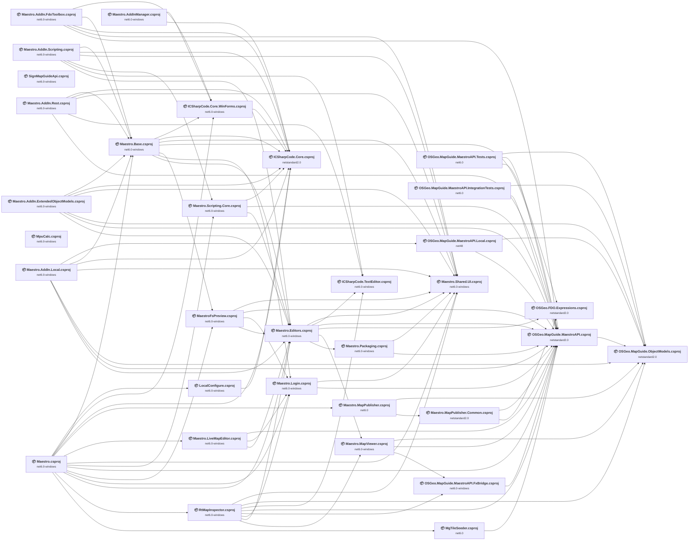

## Project Details

<a id="localconfigurelocalconfigurecsproj"></a>
### LocalConfigure\LocalConfigure.csproj

#### Project Info

- **Current Target Framework:** net6.0-windows
- **Proposed Target Framework:** net10.0--windows
- **SDK-style**: True
- **Project Kind:** DotNetCoreApp
- **Dependencies**: 1
- **Dependants**: 1
- **Number of Files**: 5
- **Number of Files with Incidents**: 1
- **Lines of Code**: 266
- **Estimated LOC to modify**: 0+ (at least 0,0% of the project)

#### Dependency Graph

Legend:
📦 SDK-style project
⚙️ Classic project

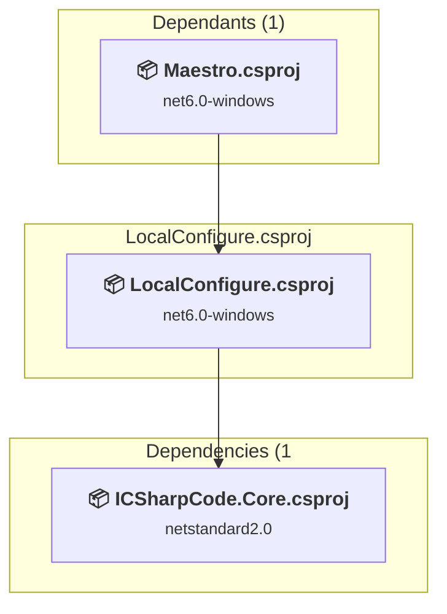

### API Compatibility

| Category | Count | Impact |
| :--- | :---: | :--- |
| 🔴 Binary Incompatible | 0 | High - Require code changes |
| 🟡 Source Incompatible | 0 | Medium - Needs re-compilation and potential conflicting API error fixing |
| 🔵 Behavioral change | 0 | Low - Behavioral changes that may require testing at runtime |
| ✅ Compatible | 0 |  |
| ***Total APIs Analyzed*** | ***0*** |  |

<a id="maestroaddinextendedobjectmodelsmaestroaddinextendedobjectmodelscsproj"></a>
### Maestro.AddIn.ExtendedObjectModels\Maestro.AddIn.ExtendedObjectModels.csproj

#### Project Info

- **Current Target Framework:** net6.0-windows
- **Proposed Target Framework:** net10.0--windows
- **SDK-style**: True
- **Project Kind:** ClassLibrary
- **Dependencies**: 6
- **Dependants**: 0
- **Number of Files**: 30
- **Number of Files with Incidents**: 1
- **Lines of Code**: 2551
- **Estimated LOC to modify**: 0+ (at least 0,0% of the project)

#### Dependency Graph

Legend:
📦 SDK-style project
⚙️ Classic project

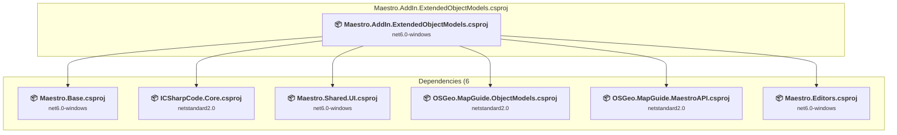

### API Compatibility

| Category | Count | Impact |
| :--- | :---: | :--- |
| 🔴 Binary Incompatible | 0 | High - Require code changes |
| 🟡 Source Incompatible | 0 | Medium - Needs re-compilation and potential conflicting API error fixing |
| 🔵 Behavioral change | 0 | Low - Behavioral changes that may require testing at runtime |
| ✅ Compatible | 0 |  |
| ***Total APIs Analyzed*** | ***0*** |  |

<a id="maestroaddinfdotoolboxmaestroaddinfdotoolboxcsproj"></a>
### Maestro.AddIn.FdoToolbox\Maestro.AddIn.FdoToolbox.csproj

#### Project Info

- **Current Target Framework:** net6.0-windows
- **Proposed Target Framework:** net10.0--windows
- **SDK-style**: True
- **Project Kind:** ClassLibrary
- **Dependencies**: 5
- **Dependants**: 0
- **Number of Files**: 8
- **Number of Files with Incidents**: 1
- **Lines of Code**: 223
- **Estimated LOC to modify**: 0+ (at least 0,0% of the project)

#### Dependency Graph

Legend:
📦 SDK-style project
⚙️ Classic project

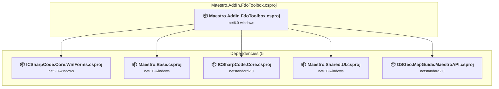

### API Compatibility

| Category | Count | Impact |
| :--- | :---: | :--- |
| 🔴 Binary Incompatible | 0 | High - Require code changes |
| 🟡 Source Incompatible | 0 | Medium - Needs re-compilation and potential conflicting API error fixing |
| 🔵 Behavioral change | 0 | Low - Behavioral changes that may require testing at runtime |
| ✅ Compatible | 0 |  |
| ***Total APIs Analyzed*** | ***0*** |  |

<a id="maestroaddinlocalmaestroaddinlocalcsproj"></a>
### Maestro.AddIn.Local\Maestro.AddIn.Local.csproj

#### Project Info

- **Current Target Framework:** net6.0-windows
- **Proposed Target Framework:** net10.0--windows
- **SDK-style**: True
- **Project Kind:** ClassLibrary
- **Dependencies**: 7
- **Dependants**: 0
- **Number of Files**: 23
- **Number of Files with Incidents**: 1
- **Lines of Code**: 1264
- **Estimated LOC to modify**: 0+ (at least 0,0% of the project)

#### Dependency Graph

Legend:
📦 SDK-style project
⚙️ Classic project

```mermaid
flowchart TB
    subgraph current["Maestro.AddIn.Local.csproj"]
        MAIN["<b>📦&nbsp;Maestro.AddIn.Local.csproj</b><br/><small>net6.0-windows</small>"]
        click MAIN "#maestroaddinlocalmaestroaddinlocalcsproj"
    end
    subgraph downstream["Dependencies (7"]
        P11["<b>📦&nbsp;OSGeo.MapGuide.MaestroAPI.Local.csproj</b><br/><small>net48</small>"]
        P3["<b>📦&nbsp;Maestro.Base.csproj</b><br/><small>net6.0-windows</small>"]
        P1["<b>📦&nbsp;ICSharpCode.Core.csproj</b><br/><small>netstandard2.0</small>"]
        P9["<b>📦&nbsp;Maestro.Shared.UI.csproj</b><br/><small>net6.0-windows</small>"]
        P23["<b>📦&nbsp;OSGeo.MapGuide.ObjectModels.csproj</b><br/><small>netstandard2.0</small>"]
        P10["<b>📦&nbsp;OSGeo.MapGuide.MaestroAPI.csproj</b><br/><small>netstandard2.0</small>"]
        P6["<b>📦&nbsp;Maestro.Editors.csproj</b><br/><small>net6.0-windows</small>"]
        click P11 "#osgeomapguidemaestroapilocalosgeomapguidemaestroapilocalcsproj"
        click P3 "#maestrobasemaestrobasecsproj"
        click P1 "#thirdpartysharpdevelopicsharpcodecoreicsharpcodecorecsproj"
        click P9 "#maestroshareduimaestroshareduicsproj"
        click P23 "#osgeomapguideobjectmodelsosgeomapguideobjectmodelscsproj"
        click P10 "#osgeomapguidemaestroapiosgeomapguidemaestroapicsproj"
        click P6 "#maestroeditorsmaestroeditorscsproj"
    end
    MAIN --> P11
    MAIN --> P3
    MAIN --> P1
    MAIN --> P9
    MAIN --> P23
    MAIN --> P10
    MAIN --> P6

```

### API Compatibility

| Category | Count | Impact |
| :--- | :---: | :--- |
| 🔴 Binary Incompatible | 0 | High - Require code changes |
| 🟡 Source Incompatible | 0 | Medium - Needs re-compilation and potential conflicting API error fixing |
| 🔵 Behavioral change | 0 | Low - Behavioral changes that may require testing at runtime |
| ✅ Compatible | 0 |  |
| ***Total APIs Analyzed*** | ***0*** |  |

<a id="maestroaddinrestmaestroaddinrestcsproj"></a>
### Maestro.AddIn.Rest\Maestro.AddIn.Rest.csproj

#### Project Info

- **Current Target Framework:** net6.0-windows
- **Proposed Target Framework:** net10.0--windows
- **SDK-style**: True
- **Project Kind:** ClassLibrary
- **Dependencies**: 5
- **Dependants**: 0
- **Number of Files**: 44
- **Number of Files with Incidents**: 1
- **Lines of Code**: 3159
- **Estimated LOC to modify**: 0+ (at least 0,0% of the project)

#### Dependency Graph

Legend:
📦 SDK-style project
⚙️ Classic project

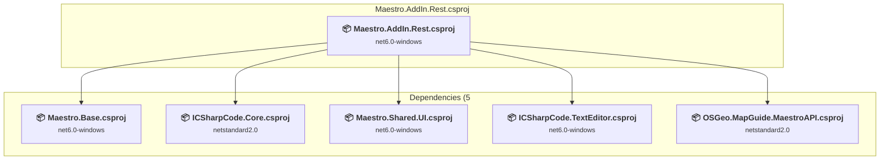

### API Compatibility

| Category | Count | Impact |
| :--- | :---: | :--- |
| 🔴 Binary Incompatible | 0 | High - Require code changes |
| 🟡 Source Incompatible | 0 | Medium - Needs re-compilation and potential conflicting API error fixing |
| 🔵 Behavioral change | 0 | Low - Behavioral changes that may require testing at runtime |
| ✅ Compatible | 0 |  |
| ***Total APIs Analyzed*** | ***0*** |  |

<a id="maestroaddinscriptingmaestroaddinscriptingcsproj"></a>
### Maestro.AddIn.Scripting\Maestro.AddIn.Scripting.csproj

#### Project Info

- **Current Target Framework:** net6.0-windows
- **Proposed Target Framework:** net10.0--windows
- **SDK-style**: True
- **Project Kind:** ClassLibrary
- **Dependencies**: 6
- **Dependants**: 0
- **Number of Files**: 19
- **Number of Files with Incidents**: 1
- **Lines of Code**: 1071
- **Estimated LOC to modify**: 0+ (at least 0,0% of the project)

#### Dependency Graph

Legend:
📦 SDK-style project
⚙️ Classic project

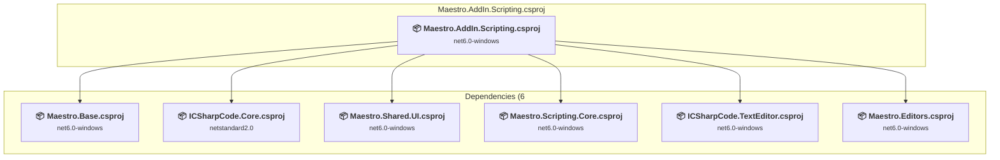

### API Compatibility

| Category | Count | Impact |
| :--- | :---: | :--- |
| 🔴 Binary Incompatible | 0 | High - Require code changes |
| 🟡 Source Incompatible | 0 | Medium - Needs re-compilation and potential conflicting API error fixing |
| 🔵 Behavioral change | 0 | Low - Behavioral changes that may require testing at runtime |
| ✅ Compatible | 0 |  |
| ***Total APIs Analyzed*** | ***0*** |  |

<a id="maestroaddinmanagermaestroaddinmanagercsproj"></a>
### Maestro.AddInManager\Maestro.AddInManager.csproj

#### Project Info

- **Current Target Framework:** net6.0-windows
- **Proposed Target Framework:** net10.0--windows
- **SDK-style**: True
- **Project Kind:** ClassLibrary
- **Dependencies**: 2
- **Dependants**: 0
- **Number of Files**: 10
- **Number of Files with Incidents**: 1
- **Lines of Code**: 2344
- **Estimated LOC to modify**: 0+ (at least 0,0% of the project)

#### Dependency Graph

Legend:
📦 SDK-style project
⚙️ Classic project

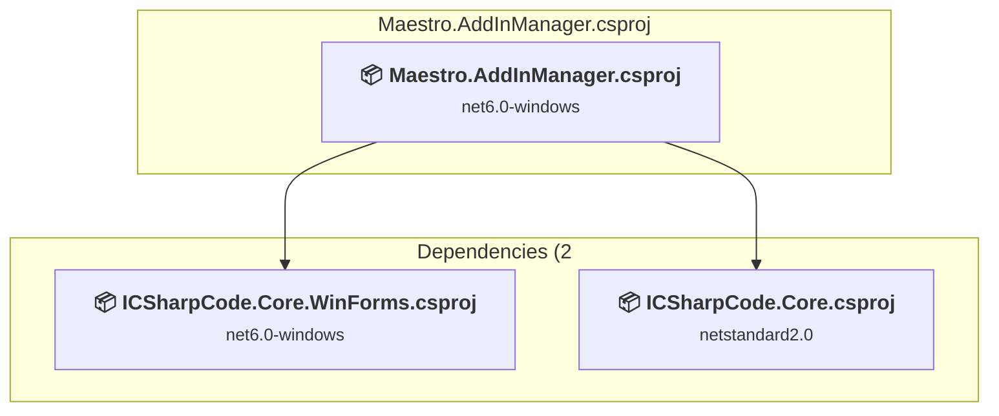

### API Compatibility

| Category | Count | Impact |
| :--- | :---: | :--- |
| 🔴 Binary Incompatible | 0 | High - Require code changes |
| 🟡 Source Incompatible | 0 | Medium - Needs re-compilation and potential conflicting API error fixing |
| 🔵 Behavioral change | 0 | Low - Behavioral changes that may require testing at runtime |
| ✅ Compatible | 0 |  |
| ***Total APIs Analyzed*** | ***0*** |  |

<a id="maestrobasemaestrobasecsproj"></a>
### Maestro.Base\Maestro.Base.csproj

#### Project Info

- **Current Target Framework:** net6.0-windows
- **Proposed Target Framework:** net10.0--windows
- **SDK-style**: True
- **Project Kind:** ClassLibrary
- **Dependencies**: 7
- **Dependants**: 6
- **Number of Files**: 263
- **Number of Files with Incidents**: 1
- **Lines of Code**: 28641
- **Estimated LOC to modify**: 0+ (at least 0,0% of the project)

#### Dependency Graph

Legend:
📦 SDK-style project
⚙️ Classic project

```mermaid
flowchart TB
    subgraph upstream["Dependants (6)"]
        P5["<b>📦&nbsp;Maestro.AddIn.ExtendedObjectModels.csproj</b><br/><small>net6.0-windows</small>"]
        P12["<b>📦&nbsp;Maestro.AddIn.Local.csproj</b><br/><small>net6.0-windows</small>"]
        P15["<b>📦&nbsp;Maestro.AddIn.FdoToolbox.csproj</b><br/><small>net6.0-windows</small>"]
        P17["<b>📦&nbsp;Maestro.AddIn.Scripting.csproj</b><br/><small>net6.0-windows</small>"]
        P26["<b>📦&nbsp;Maestro.AddIn.Rest.csproj</b><br/><small>net6.0-windows</small>"]
        P29["<b>📦&nbsp;Maestro.csproj</b><br/><small>net6.0-windows</small>"]
        click P5 "#maestroaddinextendedobjectmodelsmaestroaddinextendedobjectmodelscsproj"
        click P12 "#maestroaddinlocalmaestroaddinlocalcsproj"
        click P15 "#maestroaddinfdotoolboxmaestroaddinfdotoolboxcsproj"
        click P17 "#maestroaddinscriptingmaestroaddinscriptingcsproj"
        click P26 "#maestroaddinrestmaestroaddinrestcsproj"
        click P29 "#maestromaestrocsproj"
    end
    subgraph current["Maestro.Base.csproj"]
        MAIN["<b>📦&nbsp;Maestro.Base.csproj</b><br/><small>net6.0-windows</small>"]
        click MAIN "#maestrobasemaestrobasecsproj"
    end
    subgraph downstream["Dependencies (7"]
        P2["<b>📦&nbsp;ICSharpCode.Core.WinForms.csproj</b><br/><small>net6.0-windows</small>"]
        P1["<b>📦&nbsp;ICSharpCode.Core.csproj</b><br/><small>netstandard2.0</small>"]
        P9["<b>📦&nbsp;Maestro.Shared.UI.csproj</b><br/><small>net6.0-windows</small>"]
        P10["<b>📦&nbsp;OSGeo.MapGuide.MaestroAPI.csproj</b><br/><small>netstandard2.0</small>"]
        P4["<b>📦&nbsp;MaestroFsPreview.csproj</b><br/><small>net6.0-windows</small>"]
        P7["<b>📦&nbsp;Maestro.Login.csproj</b><br/><small>net6.0-windows</small>"]
        P6["<b>📦&nbsp;Maestro.Editors.csproj</b><br/><small>net6.0-windows</small>"]
        click P2 "#thirdpartysharpdevelopicsharpcodecorewinformsicsharpcodecorewinformscsproj"
        click P1 "#thirdpartysharpdevelopicsharpcodecoreicsharpcodecorecsproj"
        click P9 "#maestroshareduimaestroshareduicsproj"
        click P10 "#osgeomapguidemaestroapiosgeomapguidemaestroapicsproj"
        click P4 "#maestrofspreviewmaestrofspreviewcsproj"
        click P7 "#maestrologinmaestrologincsproj"
        click P6 "#maestroeditorsmaestroeditorscsproj"
    end
    P5 --> MAIN
    P12 --> MAIN
    P15 --> MAIN
    P17 --> MAIN
    P26 --> MAIN
    P29 --> MAIN
    MAIN --> P2
    MAIN --> P1
    MAIN --> P9
    MAIN --> P10
    MAIN --> P4
    MAIN --> P7
    MAIN --> P6

```

### API Compatibility

| Category | Count | Impact |
| :--- | :---: | :--- |
| 🔴 Binary Incompatible | 0 | High - Require code changes |
| 🟡 Source Incompatible | 0 | Medium - Needs re-compilation and potential conflicting API error fixing |
| 🔵 Behavioral change | 0 | Low - Behavioral changes that may require testing at runtime |
| ✅ Compatible | 0 |  |
| ***Total APIs Analyzed*** | ***0*** |  |

<a id="maestroeditorsmaestroeditorscsproj"></a>
### Maestro.Editors\Maestro.Editors.csproj

#### Project Info

- **Current Target Framework:** net6.0-windows
- **Proposed Target Framework:** net10.0--windows
- **SDK-style**: True
- **Project Kind:** ClassLibrary
- **Dependencies**: 6
- **Dependants**: 9
- **Number of Files**: 936
- **Number of Files with Incidents**: 1
- **Lines of Code**: 99829
- **Estimated LOC to modify**: 0+ (at least 0,0% of the project)

#### Dependency Graph

Legend:
📦 SDK-style project
⚙️ Classic project

```mermaid
flowchart TB
    subgraph upstream["Dependants (9)"]
        P3["<b>📦&nbsp;Maestro.Base.csproj</b><br/><small>net6.0-windows</small>"]
        P4["<b>📦&nbsp;MaestroFsPreview.csproj</b><br/><small>net6.0-windows</small>"]
        P5["<b>📦&nbsp;Maestro.AddIn.ExtendedObjectModels.csproj</b><br/><small>net6.0-windows</small>"]
        P12["<b>📦&nbsp;Maestro.AddIn.Local.csproj</b><br/><small>net6.0-windows</small>"]
        P16["<b>📦&nbsp;RtMapInspector.csproj</b><br/><small>net6.0-windows</small>"]
        P17["<b>📦&nbsp;Maestro.AddIn.Scripting.csproj</b><br/><small>net6.0-windows</small>"]
        P21["<b>📦&nbsp;Maestro.LiveMapEditor.csproj</b><br/><small>net6.0-windows</small>"]
        P29["<b>📦&nbsp;Maestro.csproj</b><br/><small>net6.0-windows</small>"]
        P33["<b>📦&nbsp;Maestro.Scripting.Core.csproj</b><br/><small>net6.0-windows</small>"]
        click P3 "#maestrobasemaestrobasecsproj"
        click P4 "#maestrofspreviewmaestrofspreviewcsproj"
        click P5 "#maestroaddinextendedobjectmodelsmaestroaddinextendedobjectmodelscsproj"
        click P12 "#maestroaddinlocalmaestroaddinlocalcsproj"
        click P16 "#rtmapinspectorrtmapinspectorcsproj"
        click P17 "#maestroaddinscriptingmaestroaddinscriptingcsproj"
        click P21 "#maestrolivemapeditormaestrolivemapeditorcsproj"
        click P29 "#maestromaestrocsproj"
        click P33 "#maestroscriptingcoremaestroscriptingcorecsproj"
    end
    subgraph current["Maestro.Editors.csproj"]
        MAIN["<b>📦&nbsp;Maestro.Editors.csproj</b><br/><small>net6.0-windows</small>"]
        click MAIN "#maestroeditorsmaestroeditorscsproj"
    end
    subgraph downstream["Dependencies (6"]
        P9["<b>📦&nbsp;Maestro.Shared.UI.csproj</b><br/><small>net6.0-windows</small>"]
        P18["<b>📦&nbsp;ICSharpCode.TextEditor.csproj</b><br/><small>net6.0-windows</small>"]
        P10["<b>📦&nbsp;OSGeo.MapGuide.MaestroAPI.csproj</b><br/><small>netstandard2.0</small>"]
        P25["<b>📦&nbsp;OSGeo.FDO.Expressions.csproj</b><br/><small>netstandard2.0</small>"]
        P20["<b>📦&nbsp;Maestro.MapViewer.csproj</b><br/><small>net6.0-windows</small>"]
        P8["<b>📦&nbsp;Maestro.Packaging.csproj</b><br/><small>net6.0-windows</small>"]
        click P9 "#maestroshareduimaestroshareduicsproj"
        click P18 "#thirdpartysharpdevelopicsharpcodetexteditoricsharpcodetexteditorcsproj"
        click P10 "#osgeomapguidemaestroapiosgeomapguidemaestroapicsproj"
        click P25 "#osgeofdoexpressionsosgeofdoexpressionscsproj"
        click P20 "#maestromapviewermaestromapviewercsproj"
        click P8 "#maestropackagingmaestropackagingcsproj"
    end
    P3 --> MAIN
    P4 --> MAIN
    P5 --> MAIN
    P12 --> MAIN
    P16 --> MAIN
    P17 --> MAIN
    P21 --> MAIN
    P29 --> MAIN
    P33 --> MAIN
    MAIN --> P9
    MAIN --> P18
    MAIN --> P10
    MAIN --> P25
    MAIN --> P20
    MAIN --> P8

```

### API Compatibility

| Category | Count | Impact |
| :--- | :---: | :--- |
| 🔴 Binary Incompatible | 0 | High - Require code changes |
| 🟡 Source Incompatible | 0 | Medium - Needs re-compilation and potential conflicting API error fixing |
| 🔵 Behavioral change | 0 | Low - Behavioral changes that may require testing at runtime |
| ✅ Compatible | 0 |  |
| ***Total APIs Analyzed*** | ***0*** |  |

<a id="maestrolivemapeditormaestrolivemapeditorcsproj"></a>
### Maestro.LiveMapEditor\Maestro.LiveMapEditor.csproj

#### Project Info

- **Current Target Framework:** net6.0-windows
- **Proposed Target Framework:** net10.0-windows
- **SDK-style**: True
- **Project Kind:** WinForms
- **Dependencies**: 3
- **Dependants**: 1
- **Number of Files**: 22
- **Number of Files with Incidents**: 1
- **Lines of Code**: 1921
- **Estimated LOC to modify**: 0+ (at least 0,0% of the project)

#### Dependency Graph

Legend:
📦 SDK-style project
⚙️ Classic project

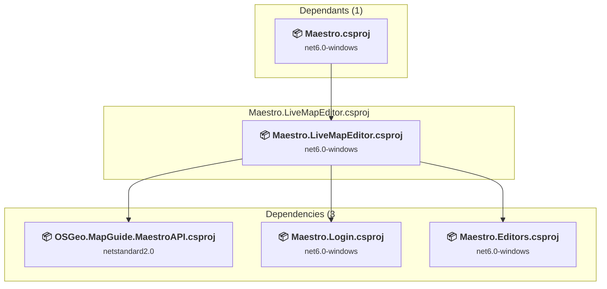

### API Compatibility

| Category | Count | Impact |
| :--- | :---: | :--- |
| 🔴 Binary Incompatible | 0 | High - Require code changes |
| 🟡 Source Incompatible | 0 | Medium - Needs re-compilation and potential conflicting API error fixing |
| 🔵 Behavioral change | 0 | Low - Behavioral changes that may require testing at runtime |
| ✅ Compatible | 0 |  |
| ***Total APIs Analyzed*** | ***0*** |  |

<a id="maestrologinmaestrologincsproj"></a>
### Maestro.Login\Maestro.Login.csproj

#### Project Info

- **Current Target Framework:** net6.0-windows
- **Proposed Target Framework:** net10.0--windows
- **SDK-style**: True
- **Project Kind:** ClassLibrary
- **Dependencies**: 2
- **Dependants**: 5
- **Number of Files**: 33
- **Number of Files with Incidents**: 1
- **Lines of Code**: 2722
- **Estimated LOC to modify**: 0+ (at least 0,0% of the project)

#### Dependency Graph

Legend:
📦 SDK-style project
⚙️ Classic project

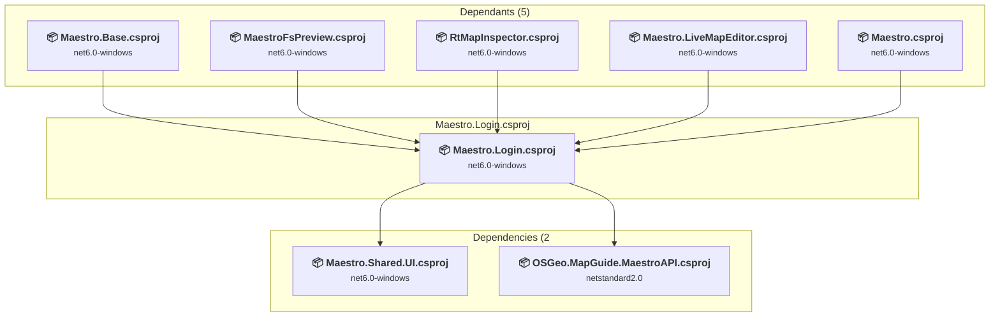

### API Compatibility

| Category | Count | Impact |
| :--- | :---: | :--- |
| 🔴 Binary Incompatible | 0 | High - Require code changes |
| 🟡 Source Incompatible | 0 | Medium - Needs re-compilation and potential conflicting API error fixing |
| 🔵 Behavioral change | 0 | Low - Behavioral changes that may require testing at runtime |
| ✅ Compatible | 0 |  |
| ***Total APIs Analyzed*** | ***0*** |  |

<a id="maestromappublishercommonmaestromappublishercommoncsproj"></a>
### Maestro.MapPublisher.Common\Maestro.MapPublisher.Common.csproj

#### Project Info

- **Current Target Framework:** netstandard2.0✅
- **SDK-style**: True
- **Project Kind:** ClassLibrary
- **Dependencies**: 2
- **Dependants**: 1
- **Number of Files**: 17
- **Lines of Code**: 2637
- **Estimated LOC to modify**: 0+ (at least 0,0% of the project)

#### Dependency Graph

Legend:
📦 SDK-style project
⚙️ Classic project

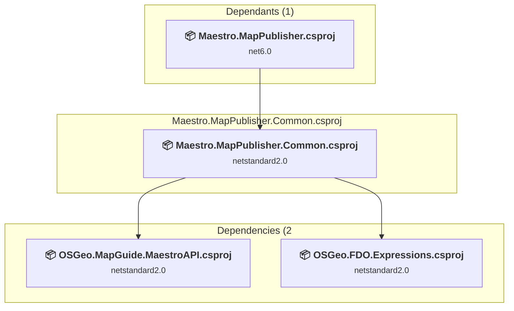

### API Compatibility

| Category | Count | Impact |
| :--- | :---: | :--- |
| 🔴 Binary Incompatible | 0 | High - Require code changes |
| 🟡 Source Incompatible | 0 | Medium - Needs re-compilation and potential conflicting API error fixing |
| 🔵 Behavioral change | 0 | Low - Behavioral changes that may require testing at runtime |
| ✅ Compatible | 0 |  |
| ***Total APIs Analyzed*** | ***0*** |  |

<a id="maestromappublishermaestromappublishercsproj"></a>
### Maestro.MapPublisher\Maestro.MapPublisher.csproj

#### Project Info

- **Current Target Framework:** net6.0
- **Proposed Target Framework:** net10.0
- **SDK-style**: True
- **Project Kind:** DotNetCoreApp
- **Dependencies**: 2
- **Dependants**: 1
- **Number of Files**: 171
- **Number of Files with Incidents**: 1
- **Lines of Code**: 1423
- **Estimated LOC to modify**: 0+ (at least 0,0% of the project)

#### Dependency Graph

Legend:
📦 SDK-style project
⚙️ Classic project

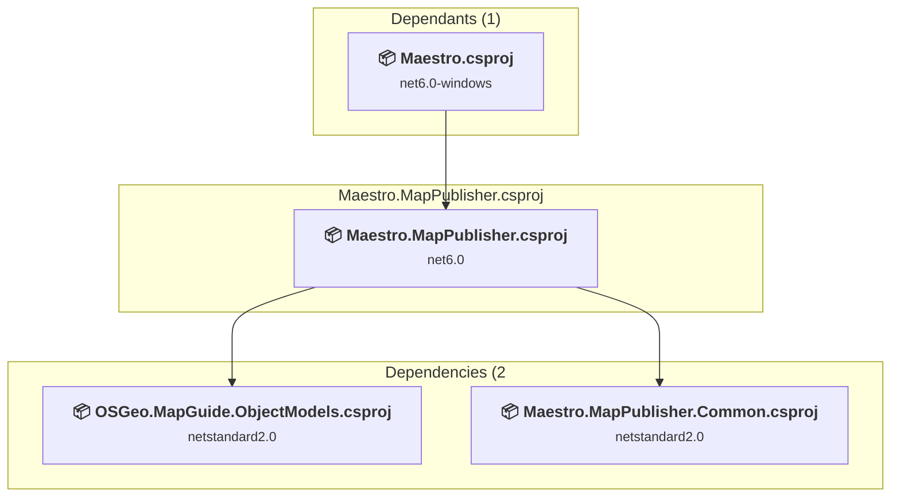

### API Compatibility

| Category | Count | Impact |
| :--- | :---: | :--- |
| 🔴 Binary Incompatible | 0 | High - Require code changes |
| 🟡 Source Incompatible | 0 | Medium - Needs re-compilation and potential conflicting API error fixing |
| 🔵 Behavioral change | 0 | Low - Behavioral changes that may require testing at runtime |
| ✅ Compatible | 0 |  |
| ***Total APIs Analyzed*** | ***0*** |  |

<a id="maestromapviewermaestromapviewercsproj"></a>
### Maestro.MapViewer\Maestro.MapViewer.csproj

#### Project Info

- **Current Target Framework:** net6.0-windows
- **Proposed Target Framework:** net10.0--windows
- **SDK-style**: True
- **Project Kind:** ClassLibrary
- **Dependencies**: 3
- **Dependants**: 2
- **Number of Files**: 19
- **Number of Files with Incidents**: 1
- **Lines of Code**: 7842
- **Estimated LOC to modify**: 0+ (at least 0,0% of the project)

#### Dependency Graph

Legend:
📦 SDK-style project
⚙️ Classic project

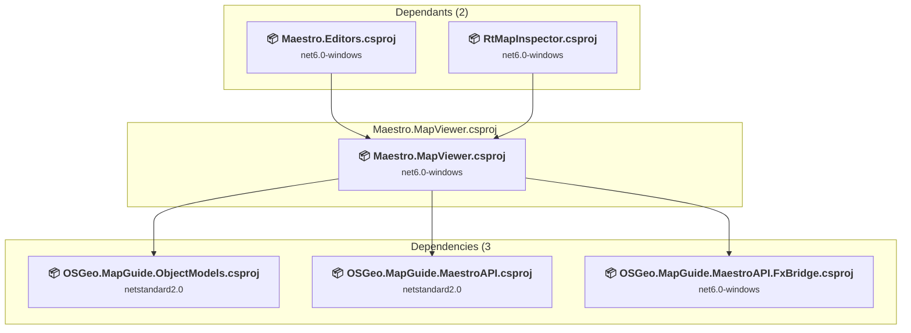

### API Compatibility

| Category | Count | Impact |
| :--- | :---: | :--- |
| 🔴 Binary Incompatible | 0 | High - Require code changes |
| 🟡 Source Incompatible | 0 | Medium - Needs re-compilation and potential conflicting API error fixing |
| 🔵 Behavioral change | 0 | Low - Behavioral changes that may require testing at runtime |
| ✅ Compatible | 0 |  |
| ***Total APIs Analyzed*** | ***0*** |  |

<a id="maestropackagingmaestropackagingcsproj"></a>
### Maestro.Packaging\Maestro.Packaging.csproj

#### Project Info

- **Current Target Framework:** net6.0-windows
- **Proposed Target Framework:** net10.0--windows
- **SDK-style**: True
- **Project Kind:** ClassLibrary
- **Dependencies**: 2
- **Dependants**: 1
- **Number of Files**: 22
- **Number of Files with Incidents**: 1
- **Lines of Code**: 3262
- **Estimated LOC to modify**: 0+ (at least 0,0% of the project)

#### Dependency Graph

Legend:
📦 SDK-style project
⚙️ Classic project

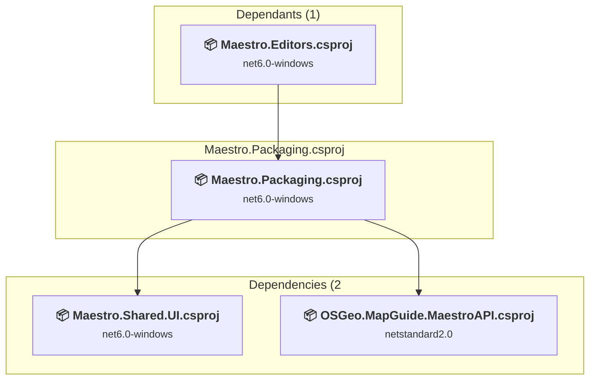

### API Compatibility

| Category | Count | Impact |
| :--- | :---: | :--- |
| 🔴 Binary Incompatible | 0 | High - Require code changes |
| 🟡 Source Incompatible | 0 | Medium - Needs re-compilation and potential conflicting API error fixing |
| 🔵 Behavioral change | 0 | Low - Behavioral changes that may require testing at runtime |
| ✅ Compatible | 0 |  |
| ***Total APIs Analyzed*** | ***0*** |  |

<a id="maestroscriptingcoremaestroscriptingcorecsproj"></a>
### Maestro.Scripting.Core\Maestro.Scripting.Core.csproj

#### Project Info

- **Current Target Framework:** net6.0-windows
- **Proposed Target Framework:** net10.0--windows
- **SDK-style**: True
- **Project Kind:** ClassLibrary
- **Dependencies**: 3
- **Dependants**: 2
- **Number of Files**: 11
- **Number of Files with Incidents**: 1
- **Lines of Code**: 1265
- **Estimated LOC to modify**: 0+ (at least 0,0% of the project)

#### Dependency Graph

Legend:
📦 SDK-style project
⚙️ Classic project

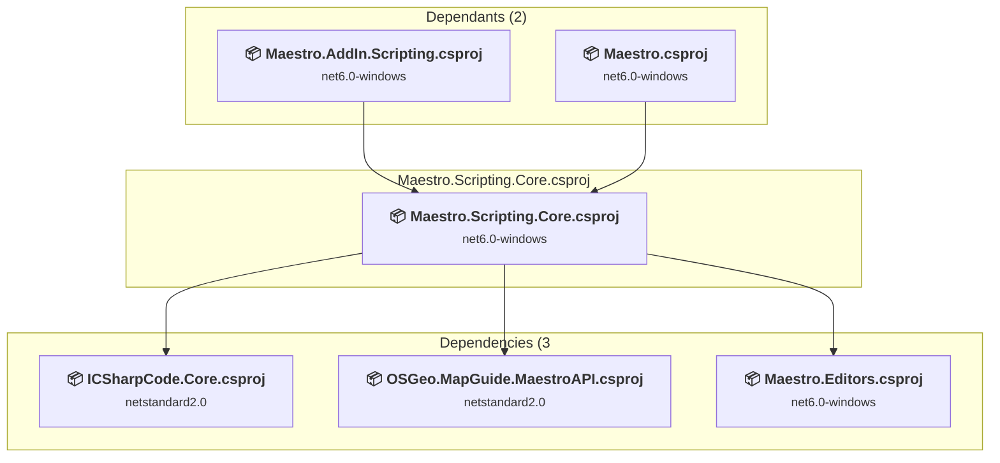

### API Compatibility

| Category | Count | Impact |
| :--- | :---: | :--- |
| 🔴 Binary Incompatible | 0 | High - Require code changes |
| 🟡 Source Incompatible | 0 | Medium - Needs re-compilation and potential conflicting API error fixing |
| 🔵 Behavioral change | 0 | Low - Behavioral changes that may require testing at runtime |
| ✅ Compatible | 0 |  |
| ***Total APIs Analyzed*** | ***0*** |  |

<a id="maestroshareduimaestroshareduicsproj"></a>
### Maestro.Shared.UI\Maestro.Shared.UI.csproj

#### Project Info

- **Current Target Framework:** net6.0-windows
- **Proposed Target Framework:** net10.0--windows
- **SDK-style**: True
- **Project Kind:** ClassLibrary
- **Dependencies**: 0
- **Dependants**: 12
- **Number of Files**: 116
- **Number of Files with Incidents**: 1
- **Lines of Code**: 3699
- **Estimated LOC to modify**: 0+ (at least 0,0% of the project)

#### Dependency Graph

Legend:
📦 SDK-style project
⚙️ Classic project

```mermaid
flowchart TB
    subgraph upstream["Dependants (12)"]
        P3["<b>📦&nbsp;Maestro.Base.csproj</b><br/><small>net6.0-windows</small>"]
        P4["<b>📦&nbsp;MaestroFsPreview.csproj</b><br/><small>net6.0-windows</small>"]
        P5["<b>📦&nbsp;Maestro.AddIn.ExtendedObjectModels.csproj</b><br/><small>net6.0-windows</small>"]
        P6["<b>📦&nbsp;Maestro.Editors.csproj</b><br/><small>net6.0-windows</small>"]
        P7["<b>📦&nbsp;Maestro.Login.csproj</b><br/><small>net6.0-windows</small>"]
        P8["<b>📦&nbsp;Maestro.Packaging.csproj</b><br/><small>net6.0-windows</small>"]
        P12["<b>📦&nbsp;Maestro.AddIn.Local.csproj</b><br/><small>net6.0-windows</small>"]
        P15["<b>📦&nbsp;Maestro.AddIn.FdoToolbox.csproj</b><br/><small>net6.0-windows</small>"]
        P16["<b>📦&nbsp;RtMapInspector.csproj</b><br/><small>net6.0-windows</small>"]
        P17["<b>📦&nbsp;Maestro.AddIn.Scripting.csproj</b><br/><small>net6.0-windows</small>"]
        P26["<b>📦&nbsp;Maestro.AddIn.Rest.csproj</b><br/><small>net6.0-windows</small>"]
        P29["<b>📦&nbsp;Maestro.csproj</b><br/><small>net6.0-windows</small>"]
        click P3 "#maestrobasemaestrobasecsproj"
        click P4 "#maestrofspreviewmaestrofspreviewcsproj"
        click P5 "#maestroaddinextendedobjectmodelsmaestroaddinextendedobjectmodelscsproj"
        click P6 "#maestroeditorsmaestroeditorscsproj"
        click P7 "#maestrologinmaestrologincsproj"
        click P8 "#maestropackagingmaestropackagingcsproj"
        click P12 "#maestroaddinlocalmaestroaddinlocalcsproj"
        click P15 "#maestroaddinfdotoolboxmaestroaddinfdotoolboxcsproj"
        click P16 "#rtmapinspectorrtmapinspectorcsproj"
        click P17 "#maestroaddinscriptingmaestroaddinscriptingcsproj"
        click P26 "#maestroaddinrestmaestroaddinrestcsproj"
        click P29 "#maestromaestrocsproj"
    end
    subgraph current["Maestro.Shared.UI.csproj"]
        MAIN["<b>📦&nbsp;Maestro.Shared.UI.csproj</b><br/><small>net6.0-windows</small>"]
        click MAIN "#maestroshareduimaestroshareduicsproj"
    end
    P3 --> MAIN
    P4 --> MAIN
    P5 --> MAIN
    P6 --> MAIN
    P7 --> MAIN
    P8 --> MAIN
    P12 --> MAIN
    P15 --> MAIN
    P16 --> MAIN
    P17 --> MAIN
    P26 --> MAIN
    P29 --> MAIN

```

### API Compatibility

| Category | Count | Impact |
| :--- | :---: | :--- |
| 🔴 Binary Incompatible | 0 | High - Require code changes |
| 🟡 Source Incompatible | 0 | Medium - Needs re-compilation and potential conflicting API error fixing |
| 🔵 Behavioral change | 0 | Low - Behavioral changes that may require testing at runtime |
| ✅ Compatible | 0 |  |
| ***Total APIs Analyzed*** | ***0*** |  |

<a id="maestromaestrocsproj"></a>
### Maestro\Maestro.csproj

#### Project Info

- **Current Target Framework:** net6.0-windows
- **Proposed Target Framework:** net10.0-windows
- **SDK-style**: True
- **Project Kind:** WinForms
- **Dependencies**: 14
- **Dependants**: 0
- **Number of Files**: 19
- **Number of Files with Incidents**: 1
- **Lines of Code**: 520
- **Estimated LOC to modify**: 0+ (at least 0,0% of the project)

#### Dependency Graph

Legend:
📦 SDK-style project
⚙️ Classic project

```mermaid
flowchart TB
    subgraph current["Maestro.csproj"]
        MAIN["<b>📦&nbsp;Maestro.csproj</b><br/><small>net6.0-windows</small>"]
        click MAIN "#maestromaestrocsproj"
    end
    subgraph downstream["Dependencies (14"]
        P13["<b>📦&nbsp;LocalConfigure.csproj</b><br/><small>net6.0-windows</small>"]
        P2["<b>📦&nbsp;ICSharpCode.Core.WinForms.csproj</b><br/><small>net6.0-windows</small>"]
        P3["<b>📦&nbsp;Maestro.Base.csproj</b><br/><small>net6.0-windows</small>"]
        P1["<b>📦&nbsp;ICSharpCode.Core.csproj</b><br/><small>netstandard2.0</small>"]
        P31["<b>📦&nbsp;Maestro.MapPublisher.csproj</b><br/><small>net6.0</small>"]
        P21["<b>📦&nbsp;Maestro.LiveMapEditor.csproj</b><br/><small>net6.0-windows</small>"]
        P9["<b>📦&nbsp;Maestro.Shared.UI.csproj</b><br/><small>net6.0-windows</small>"]
        P33["<b>📦&nbsp;Maestro.Scripting.Core.csproj</b><br/><small>net6.0-windows</small>"]
        P10["<b>📦&nbsp;OSGeo.MapGuide.MaestroAPI.csproj</b><br/><small>netstandard2.0</small>"]
        P4["<b>📦&nbsp;MaestroFsPreview.csproj</b><br/><small>net6.0-windows</small>"]
        P7["<b>📦&nbsp;Maestro.Login.csproj</b><br/><small>net6.0-windows</small>"]
        P6["<b>📦&nbsp;Maestro.Editors.csproj</b><br/><small>net6.0-windows</small>"]
        P16["<b>📦&nbsp;RtMapInspector.csproj</b><br/><small>net6.0-windows</small>"]
        P30["<b>📦&nbsp;MgTileSeeder.csproj</b><br/><small>net6.0</small>"]
        click P13 "#localconfigurelocalconfigurecsproj"
        click P2 "#thirdpartysharpdevelopicsharpcodecorewinformsicsharpcodecorewinformscsproj"
        click P3 "#maestrobasemaestrobasecsproj"
        click P1 "#thirdpartysharpdevelopicsharpcodecoreicsharpcodecorecsproj"
        click P31 "#maestromappublishermaestromappublishercsproj"
        click P21 "#maestrolivemapeditormaestrolivemapeditorcsproj"
        click P9 "#maestroshareduimaestroshareduicsproj"
        click P33 "#maestroscriptingcoremaestroscriptingcorecsproj"
        click P10 "#osgeomapguidemaestroapiosgeomapguidemaestroapicsproj"
        click P4 "#maestrofspreviewmaestrofspreviewcsproj"
        click P7 "#maestrologinmaestrologincsproj"
        click P6 "#maestroeditorsmaestroeditorscsproj"
        click P16 "#rtmapinspectorrtmapinspectorcsproj"
        click P30 "#mgtileseedermgtileseedercsproj"
    end
    MAIN --> P13
    MAIN --> P2
    MAIN --> P3
    MAIN --> P1
    MAIN --> P31
    MAIN --> P21
    MAIN --> P9
    MAIN --> P33
    MAIN --> P10
    MAIN --> P4
    MAIN --> P7
    MAIN --> P6
    MAIN --> P16
    MAIN --> P30

```

### API Compatibility

| Category | Count | Impact |
| :--- | :---: | :--- |
| 🔴 Binary Incompatible | 0 | High - Require code changes |
| 🟡 Source Incompatible | 0 | Medium - Needs re-compilation and potential conflicting API error fixing |
| 🔵 Behavioral change | 0 | Low - Behavioral changes that may require testing at runtime |
| ✅ Compatible | 0 |  |
| ***Total APIs Analyzed*** | ***0*** |  |

<a id="maestrofspreviewmaestrofspreviewcsproj"></a>
### MaestroFsPreview\MaestroFsPreview.csproj

#### Project Info

- **Current Target Framework:** net6.0-windows
- **Proposed Target Framework:** net10.0-windows
- **SDK-style**: True
- **Project Kind:** WinForms
- **Dependencies**: 4
- **Dependants**: 2
- **Number of Files**: 13
- **Number of Files with Incidents**: 1
- **Lines of Code**: 648
- **Estimated LOC to modify**: 0+ (at least 0,0% of the project)

#### Dependency Graph

Legend:
📦 SDK-style project
⚙️ Classic project

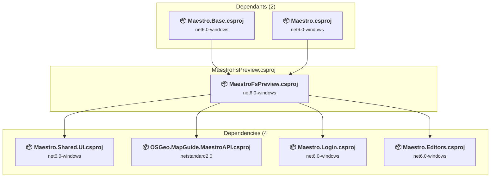

### API Compatibility

| Category | Count | Impact |
| :--- | :---: | :--- |
| 🔴 Binary Incompatible | 0 | High - Require code changes |
| 🟡 Source Incompatible | 0 | Medium - Needs re-compilation and potential conflicting API error fixing |
| 🔵 Behavioral change | 0 | Low - Behavioral changes that may require testing at runtime |
| ✅ Compatible | 0 |  |
| ***Total APIs Analyzed*** | ***0*** |  |

<a id="mgtileseedermgtileseedercsproj"></a>
### MgTileSeeder\MgTileSeeder.csproj

#### Project Info

- **Current Target Framework:** net6.0
- **Proposed Target Framework:** net10.0
- **SDK-style**: True
- **Project Kind:** DotNetCoreApp
- **Dependencies**: 1
- **Dependants**: 1
- **Number of Files**: 1
- **Number of Files with Incidents**: 1
- **Lines of Code**: 526
- **Estimated LOC to modify**: 0+ (at least 0,0% of the project)

#### Dependency Graph

Legend:
📦 SDK-style project
⚙️ Classic project

```mermaid
flowchart TB
    subgraph upstream["Dependants (1)"]
        P29["<b>📦&nbsp;Maestro.csproj</b><br/><small>net6.0-windows</small>"]
        click P29 "#maestromaestrocsproj"
    end
    subgraph current["MgTileSeeder.csproj"]
        MAIN["<b>📦&nbsp;MgTileSeeder.csproj</b><br/><small>net6.0</small>"]
        click MAIN "#mgtileseedermgtileseedercsproj"
    end
    subgraph downstream["Dependencies (1"]
        P10["<b>📦&nbsp;OSGeo.MapGuide.MaestroAPI.csproj</b><br/><small>netstandard2.0</small>"]
        click P10 "#osgeomapguidemaestroapiosgeomapguidemaestroapicsproj"
    end
    P29 --> MAIN
    MAIN --> P10

```

### API Compatibility

| Category | Count | Impact |
| :--- | :---: | :--- |
| 🔴 Binary Incompatible | 0 | High - Require code changes |
| 🟡 Source Incompatible | 0 | Medium - Needs re-compilation and potential conflicting API error fixing |
| 🔵 Behavioral change | 0 | Low - Behavioral changes that may require testing at runtime |
| ✅ Compatible | 0 |  |
| ***Total APIs Analyzed*** | ***0*** |  |

<a id="mpucalcmpucalccsproj"></a>
### MpuCalc\MpuCalc.csproj

#### Project Info

- **Current Target Framework:** net6.0-windows
- **Proposed Target Framework:** net10.0--windows
- **SDK-style**: True
- **Project Kind:** DotNetCoreApp
- **Dependencies**: 0
- **Dependants**: 0
- **Number of Files**: 3
- **Number of Files with Incidents**: 1
- **Lines of Code**: 166
- **Estimated LOC to modify**: 0+ (at least 0,0% of the project)

#### Dependency Graph

Legend:
📦 SDK-style project
⚙️ Classic project

```mermaid
flowchart TB
    subgraph current["MpuCalc.csproj"]
        MAIN["<b>📦&nbsp;MpuCalc.csproj</b><br/><small>net6.0-windows</small>"]
        click MAIN "#mpucalcmpucalccsproj"
    end

```

### API Compatibility

| Category | Count | Impact |
| :--- | :---: | :--- |
| 🔴 Binary Incompatible | 0 | High - Require code changes |
| 🟡 Source Incompatible | 0 | Medium - Needs re-compilation and potential conflicting API error fixing |
| 🔵 Behavioral change | 0 | Low - Behavioral changes that may require testing at runtime |
| ✅ Compatible | 0 |  |
| ***Total APIs Analyzed*** | ***0*** |  |

<a id="osgeofdoexpressionsosgeofdoexpressionscsproj"></a>
### OSGeo.FDO.Expressions\OSGeo.FDO.Expressions.csproj

#### Project Info

- **Current Target Framework:** netstandard2.0✅
- **SDK-style**: True
- **Project Kind:** ClassLibrary
- **Dependencies**: 0
- **Dependants**: 3
- **Number of Files**: 32
- **Lines of Code**: 2683
- **Estimated LOC to modify**: 0+ (at least 0,0% of the project)

#### Dependency Graph

Legend:
📦 SDK-style project
⚙️ Classic project

```mermaid
flowchart TB
    subgraph upstream["Dependants (3)"]
        P6["<b>📦&nbsp;Maestro.Editors.csproj</b><br/><small>net6.0-windows</small>"]
        P24["<b>📦&nbsp;OSGeo.MapGuide.MaestroAPI.Tests.csproj</b><br/><small>net6.0</small>"]
        P32["<b>📦&nbsp;Maestro.MapPublisher.Common.csproj</b><br/><small>netstandard2.0</small>"]
        click P6 "#maestroeditorsmaestroeditorscsproj"
        click P24 "#osgeomapguidemaestroapitestsosgeomapguidemaestroapitestscsproj"
        click P32 "#maestromappublishercommonmaestromappublishercommoncsproj"
    end
    subgraph current["OSGeo.FDO.Expressions.csproj"]
        MAIN["<b>📦&nbsp;OSGeo.FDO.Expressions.csproj</b><br/><small>netstandard2.0</small>"]
        click MAIN "#osgeofdoexpressionsosgeofdoexpressionscsproj"
    end
    P6 --> MAIN
    P24 --> MAIN
    P32 --> MAIN

```

### API Compatibility

| Category | Count | Impact |
| :--- | :---: | :--- |
| 🔴 Binary Incompatible | 0 | High - Require code changes |
| 🟡 Source Incompatible | 0 | Medium - Needs re-compilation and potential conflicting API error fixing |
| 🔵 Behavioral change | 0 | Low - Behavioral changes that may require testing at runtime |
| ✅ Compatible | 0 |  |
| ***Total APIs Analyzed*** | ***0*** |  |

<a id="osgeomapguidemaestroapifxbridgeosgeomapguidemaestroapifxbridgecsproj"></a>
### OSGeo.MapGuide.MaestroAPI.FxBridge\OSGeo.MapGuide.MaestroAPI.FxBridge.csproj

#### Project Info

- **Current Target Framework:** net6.0-windows
- **Proposed Target Framework:** net10.0--windows
- **SDK-style**: True
- **Project Kind:** ClassLibrary
- **Dependencies**: 1
- **Dependants**: 2
- **Number of Files**: 5
- **Number of Files with Incidents**: 1
- **Lines of Code**: 214
- **Estimated LOC to modify**: 0+ (at least 0,0% of the project)

#### Dependency Graph

Legend:
📦 SDK-style project
⚙️ Classic project

```mermaid
flowchart TB
    subgraph upstream["Dependants (2)"]
        P16["<b>📦&nbsp;RtMapInspector.csproj</b><br/><small>net6.0-windows</small>"]
        P20["<b>📦&nbsp;Maestro.MapViewer.csproj</b><br/><small>net6.0-windows</small>"]
        click P16 "#rtmapinspectorrtmapinspectorcsproj"
        click P20 "#maestromapviewermaestromapviewercsproj"
    end
    subgraph current["OSGeo.MapGuide.MaestroAPI.FxBridge.csproj"]
        MAIN["<b>📦&nbsp;OSGeo.MapGuide.MaestroAPI.FxBridge.csproj</b><br/><small>net6.0-windows</small>"]
        click MAIN "#osgeomapguidemaestroapifxbridgeosgeomapguidemaestroapifxbridgecsproj"
    end
    subgraph downstream["Dependencies (1"]
        P10["<b>📦&nbsp;OSGeo.MapGuide.MaestroAPI.csproj</b><br/><small>netstandard2.0</small>"]
        click P10 "#osgeomapguidemaestroapiosgeomapguidemaestroapicsproj"
    end
    P16 --> MAIN
    P20 --> MAIN
    MAIN --> P10

```

### API Compatibility

| Category | Count | Impact |
| :--- | :---: | :--- |
| 🔴 Binary Incompatible | 0 | High - Require code changes |
| 🟡 Source Incompatible | 0 | Medium - Needs re-compilation and potential conflicting API error fixing |
| 🔵 Behavioral change | 0 | Low - Behavioral changes that may require testing at runtime |
| ✅ Compatible | 0 |  |
| ***Total APIs Analyzed*** | ***0*** |  |

<a id="osgeomapguidemaestroapiintegrationtestsosgeomapguidemaestroapiintegrationtestscsproj"></a>
### OSGeo.MapGuide.MaestroAPI.IntegrationTests\OSGeo.MapGuide.MaestroAPI.IntegrationTests.csproj

#### Project Info

- **Current Target Framework:** net6.0
- **Proposed Target Framework:** net10.0
- **SDK-style**: True
- **Project Kind:** DotNetCoreApp
- **Dependencies**: 2
- **Dependants**: 0
- **Number of Files**: 17
- **Number of Files with Incidents**: 1
- **Lines of Code**: 4618
- **Estimated LOC to modify**: 0+ (at least 0,0% of the project)

#### Dependency Graph

Legend:
📦 SDK-style project
⚙️ Classic project

```mermaid
flowchart TB
    subgraph current["OSGeo.MapGuide.MaestroAPI.IntegrationTests.csproj"]
        MAIN["<b>📦&nbsp;OSGeo.MapGuide.MaestroAPI.IntegrationTests.csproj</b><br/><small>net6.0</small>"]
        click MAIN "#osgeomapguidemaestroapiintegrationtestsosgeomapguidemaestroapiintegrationtestscsproj"
    end
    subgraph downstream["Dependencies (2"]
        P23["<b>📦&nbsp;OSGeo.MapGuide.ObjectModels.csproj</b><br/><small>netstandard2.0</small>"]
        P10["<b>📦&nbsp;OSGeo.MapGuide.MaestroAPI.csproj</b><br/><small>netstandard2.0</small>"]
        click P23 "#osgeomapguideobjectmodelsosgeomapguideobjectmodelscsproj"
        click P10 "#osgeomapguidemaestroapiosgeomapguidemaestroapicsproj"
    end
    MAIN --> P23
    MAIN --> P10

```

### API Compatibility

| Category | Count | Impact |
| :--- | :---: | :--- |
| 🔴 Binary Incompatible | 0 | High - Require code changes |
| 🟡 Source Incompatible | 0 | Medium - Needs re-compilation and potential conflicting API error fixing |
| 🔵 Behavioral change | 0 | Low - Behavioral changes that may require testing at runtime |
| ✅ Compatible | 0 |  |
| ***Total APIs Analyzed*** | ***0*** |  |

<a id="osgeomapguidemaestroapilocalosgeomapguidemaestroapilocalcsproj"></a>
### OSGeo.MapGuide.MaestroAPI.Local\OSGeo.MapGuide.MaestroAPI.Local.csproj

#### Project Info

- **Current Target Framework:** net48
- **Proposed Target Framework:** net10.0
- **SDK-style**: True
- **Project Kind:** ClassLibrary
- **Dependencies**: 2
- **Dependants**: 1
- **Number of Files**: 20
- **Number of Files with Incidents**: 1
- **Lines of Code**: 4524
- **Estimated LOC to modify**: 0+ (at least 0,0% of the project)

#### Dependency Graph

Legend:
📦 SDK-style project
⚙️ Classic project

```mermaid
flowchart TB
    subgraph upstream["Dependants (1)"]
        P12["<b>📦&nbsp;Maestro.AddIn.Local.csproj</b><br/><small>net6.0-windows</small>"]
        click P12 "#maestroaddinlocalmaestroaddinlocalcsproj"
    end
    subgraph current["OSGeo.MapGuide.MaestroAPI.Local.csproj"]
        MAIN["<b>📦&nbsp;OSGeo.MapGuide.MaestroAPI.Local.csproj</b><br/><small>net48</small>"]
        click MAIN "#osgeomapguidemaestroapilocalosgeomapguidemaestroapilocalcsproj"
    end
    subgraph downstream["Dependencies (2"]
        P23["<b>📦&nbsp;OSGeo.MapGuide.ObjectModels.csproj</b><br/><small>netstandard2.0</small>"]
        P10["<b>📦&nbsp;OSGeo.MapGuide.MaestroAPI.csproj</b><br/><small>netstandard2.0</small>"]
        click P23 "#osgeomapguideobjectmodelsosgeomapguideobjectmodelscsproj"
        click P10 "#osgeomapguidemaestroapiosgeomapguidemaestroapicsproj"
    end
    P12 --> MAIN
    MAIN --> P23
    MAIN --> P10

```

### API Compatibility

| Category | Count | Impact |
| :--- | :---: | :--- |
| 🔴 Binary Incompatible | 0 | High - Require code changes |
| 🟡 Source Incompatible | 0 | Medium - Needs re-compilation and potential conflicting API error fixing |
| 🔵 Behavioral change | 0 | Low - Behavioral changes that may require testing at runtime |
| ✅ Compatible | 0 |  |
| ***Total APIs Analyzed*** | ***0*** |  |

<a id="osgeomapguidemaestroapitestsosgeomapguidemaestroapitestscsproj"></a>
### OSGeo.MapGuide.MaestroAPI.Tests\OSGeo.MapGuide.MaestroAPI.Tests.csproj

#### Project Info

- **Current Target Framework:** net6.0
- **Proposed Target Framework:** net10.0
- **SDK-style**: True
- **Project Kind:** DotNetCoreApp
- **Dependencies**: 3
- **Dependants**: 0
- **Number of Files**: 45
- **Number of Files with Incidents**: 1
- **Lines of Code**: 11330
- **Estimated LOC to modify**: 0+ (at least 0,0% of the project)

#### Dependency Graph

Legend:
📦 SDK-style project
⚙️ Classic project

```mermaid
flowchart TB
    subgraph current["OSGeo.MapGuide.MaestroAPI.Tests.csproj"]
        MAIN["<b>📦&nbsp;OSGeo.MapGuide.MaestroAPI.Tests.csproj</b><br/><small>net6.0</small>"]
        click MAIN "#osgeomapguidemaestroapitestsosgeomapguidemaestroapitestscsproj"
    end
    subgraph downstream["Dependencies (3"]
        P23["<b>📦&nbsp;OSGeo.MapGuide.ObjectModels.csproj</b><br/><small>netstandard2.0</small>"]
        P10["<b>📦&nbsp;OSGeo.MapGuide.MaestroAPI.csproj</b><br/><small>netstandard2.0</small>"]
        P25["<b>📦&nbsp;OSGeo.FDO.Expressions.csproj</b><br/><small>netstandard2.0</small>"]
        click P23 "#osgeomapguideobjectmodelsosgeomapguideobjectmodelscsproj"
        click P10 "#osgeomapguidemaestroapiosgeomapguidemaestroapicsproj"
        click P25 "#osgeofdoexpressionsosgeofdoexpressionscsproj"
    end
    MAIN --> P23
    MAIN --> P10
    MAIN --> P25

```

### API Compatibility

| Category | Count | Impact |
| :--- | :---: | :--- |
| 🔴 Binary Incompatible | 0 | High - Require code changes |
| 🟡 Source Incompatible | 0 | Medium - Needs re-compilation and potential conflicting API error fixing |
| 🔵 Behavioral change | 0 | Low - Behavioral changes that may require testing at runtime |
| ✅ Compatible | 0 |  |
| ***Total APIs Analyzed*** | ***0*** |  |

<a id="osgeomapguidemaestroapiosgeomapguidemaestroapicsproj"></a>
### OSGeo.MapGuide.MaestroAPI\OSGeo.MapGuide.MaestroAPI.csproj

#### Project Info

- **Current Target Framework:** netstandard2.0✅
- **SDK-style**: True
- **Project Kind:** ClassLibrary
- **Dependencies**: 1
- **Dependants**: 20
- **Number of Files**: 185
- **Lines of Code**: 45407
- **Estimated LOC to modify**: 0+ (at least 0,0% of the project)

#### Dependency Graph

Legend:
📦 SDK-style project
⚙️ Classic project

```mermaid
flowchart TB
    subgraph upstream["Dependants (20)"]
        P3["<b>📦&nbsp;Maestro.Base.csproj</b><br/><small>net6.0-windows</small>"]
        P4["<b>📦&nbsp;MaestroFsPreview.csproj</b><br/><small>net6.0-windows</small>"]
        P5["<b>📦&nbsp;Maestro.AddIn.ExtendedObjectModels.csproj</b><br/><small>net6.0-windows</small>"]
        P6["<b>📦&nbsp;Maestro.Editors.csproj</b><br/><small>net6.0-windows</small>"]
        P7["<b>📦&nbsp;Maestro.Login.csproj</b><br/><small>net6.0-windows</small>"]
        P8["<b>📦&nbsp;Maestro.Packaging.csproj</b><br/><small>net6.0-windows</small>"]
        P11["<b>📦&nbsp;OSGeo.MapGuide.MaestroAPI.Local.csproj</b><br/><small>net48</small>"]
        P12["<b>📦&nbsp;Maestro.AddIn.Local.csproj</b><br/><small>net6.0-windows</small>"]
        P15["<b>📦&nbsp;Maestro.AddIn.FdoToolbox.csproj</b><br/><small>net6.0-windows</small>"]
        P16["<b>📦&nbsp;RtMapInspector.csproj</b><br/><small>net6.0-windows</small>"]
        P20["<b>📦&nbsp;Maestro.MapViewer.csproj</b><br/><small>net6.0-windows</small>"]
        P21["<b>📦&nbsp;Maestro.LiveMapEditor.csproj</b><br/><small>net6.0-windows</small>"]
        P24["<b>📦&nbsp;OSGeo.MapGuide.MaestroAPI.Tests.csproj</b><br/><small>net6.0</small>"]
        P26["<b>📦&nbsp;Maestro.AddIn.Rest.csproj</b><br/><small>net6.0-windows</small>"]
        P27["<b>📦&nbsp;OSGeo.MapGuide.MaestroAPI.FxBridge.csproj</b><br/><small>net6.0-windows</small>"]
        P28["<b>📦&nbsp;OSGeo.MapGuide.MaestroAPI.IntegrationTests.csproj</b><br/><small>net6.0</small>"]
        P29["<b>📦&nbsp;Maestro.csproj</b><br/><small>net6.0-windows</small>"]
        P30["<b>📦&nbsp;MgTileSeeder.csproj</b><br/><small>net6.0</small>"]
        P32["<b>📦&nbsp;Maestro.MapPublisher.Common.csproj</b><br/><small>netstandard2.0</small>"]
        P33["<b>📦&nbsp;Maestro.Scripting.Core.csproj</b><br/><small>net6.0-windows</small>"]
        click P3 "#maestrobasemaestrobasecsproj"
        click P4 "#maestrofspreviewmaestrofspreviewcsproj"
        click P5 "#maestroaddinextendedobjectmodelsmaestroaddinextendedobjectmodelscsproj"
        click P6 "#maestroeditorsmaestroeditorscsproj"
        click P7 "#maestrologinmaestrologincsproj"
        click P8 "#maestropackagingmaestropackagingcsproj"
        click P11 "#osgeomapguidemaestroapilocalosgeomapguidemaestroapilocalcsproj"
        click P12 "#maestroaddinlocalmaestroaddinlocalcsproj"
        click P15 "#maestroaddinfdotoolboxmaestroaddinfdotoolboxcsproj"
        click P16 "#rtmapinspectorrtmapinspectorcsproj"
        click P20 "#maestromapviewermaestromapviewercsproj"
        click P21 "#maestrolivemapeditormaestrolivemapeditorcsproj"
        click P24 "#osgeomapguidemaestroapitestsosgeomapguidemaestroapitestscsproj"
        click P26 "#maestroaddinrestmaestroaddinrestcsproj"
        click P27 "#osgeomapguidemaestroapifxbridgeosgeomapguidemaestroapifxbridgecsproj"
        click P28 "#osgeomapguidemaestroapiintegrationtestsosgeomapguidemaestroapiintegrationtestscsproj"
        click P29 "#maestromaestrocsproj"
        click P30 "#mgtileseedermgtileseedercsproj"
        click P32 "#maestromappublishercommonmaestromappublishercommoncsproj"
        click P33 "#maestroscriptingcoremaestroscriptingcorecsproj"
    end
    subgraph current["OSGeo.MapGuide.MaestroAPI.csproj"]
        MAIN["<b>📦&nbsp;OSGeo.MapGuide.MaestroAPI.csproj</b><br/><small>netstandard2.0</small>"]
        click MAIN "#osgeomapguidemaestroapiosgeomapguidemaestroapicsproj"
    end
    subgraph downstream["Dependencies (1"]
        P23["<b>📦&nbsp;OSGeo.MapGuide.ObjectModels.csproj</b><br/><small>netstandard2.0</small>"]
        click P23 "#osgeomapguideobjectmodelsosgeomapguideobjectmodelscsproj"
    end
    P3 --> MAIN
    P4 --> MAIN
    P5 --> MAIN
    P6 --> MAIN
    P7 --> MAIN
    P8 --> MAIN
    P11 --> MAIN
    P12 --> MAIN
    P15 --> MAIN
    P16 --> MAIN
    P20 --> MAIN
    P21 --> MAIN
    P24 --> MAIN
    P26 --> MAIN
    P27 --> MAIN
    P28 --> MAIN
    P29 --> MAIN
    P30 --> MAIN
    P32 --> MAIN
    P33 --> MAIN
    MAIN --> P23

```

### API Compatibility

| Category | Count | Impact |
| :--- | :---: | :--- |
| 🔴 Binary Incompatible | 0 | High - Require code changes |
| 🟡 Source Incompatible | 0 | Medium - Needs re-compilation and potential conflicting API error fixing |
| 🔵 Behavioral change | 0 | Low - Behavioral changes that may require testing at runtime |
| ✅ Compatible | 0 |  |
| ***Total APIs Analyzed*** | ***0*** |  |

<a id="osgeomapguideobjectmodelsosgeomapguideobjectmodelscsproj"></a>
### OSGeo.MapGuide.ObjectModels\OSGeo.MapGuide.ObjectModels.csproj

#### Project Info

- **Current Target Framework:** netstandard2.0✅
- **SDK-style**: True
- **Project Kind:** ClassLibrary
- **Dependencies**: 0
- **Dependants**: 9
- **Number of Files**: 162
- **Number of Files with Incidents**: 1
- **Lines of Code**: 274548
- **Estimated LOC to modify**: 0+ (at least 0,0% of the project)

#### Dependency Graph

Legend:
📦 SDK-style project
⚙️ Classic project

```mermaid
flowchart TB
    subgraph upstream["Dependants (9)"]
        P5["<b>📦&nbsp;Maestro.AddIn.ExtendedObjectModels.csproj</b><br/><small>net6.0-windows</small>"]
        P10["<b>📦&nbsp;OSGeo.MapGuide.MaestroAPI.csproj</b><br/><small>netstandard2.0</small>"]
        P11["<b>📦&nbsp;OSGeo.MapGuide.MaestroAPI.Local.csproj</b><br/><small>net48</small>"]
        P12["<b>📦&nbsp;Maestro.AddIn.Local.csproj</b><br/><small>net6.0-windows</small>"]
        P16["<b>📦&nbsp;RtMapInspector.csproj</b><br/><small>net6.0-windows</small>"]
        P20["<b>📦&nbsp;Maestro.MapViewer.csproj</b><br/><small>net6.0-windows</small>"]
        P24["<b>📦&nbsp;OSGeo.MapGuide.MaestroAPI.Tests.csproj</b><br/><small>net6.0</small>"]
        P28["<b>📦&nbsp;OSGeo.MapGuide.MaestroAPI.IntegrationTests.csproj</b><br/><small>net6.0</small>"]
        P31["<b>📦&nbsp;Maestro.MapPublisher.csproj</b><br/><small>net6.0</small>"]
        click P5 "#maestroaddinextendedobjectmodelsmaestroaddinextendedobjectmodelscsproj"
        click P10 "#osgeomapguidemaestroapiosgeomapguidemaestroapicsproj"
        click P11 "#osgeomapguidemaestroapilocalosgeomapguidemaestroapilocalcsproj"
        click P12 "#maestroaddinlocalmaestroaddinlocalcsproj"
        click P16 "#rtmapinspectorrtmapinspectorcsproj"
        click P20 "#maestromapviewermaestromapviewercsproj"
        click P24 "#osgeomapguidemaestroapitestsosgeomapguidemaestroapitestscsproj"
        click P28 "#osgeomapguidemaestroapiintegrationtestsosgeomapguidemaestroapiintegrationtestscsproj"
        click P31 "#maestromappublishermaestromappublishercsproj"
    end
    subgraph current["OSGeo.MapGuide.ObjectModels.csproj"]
        MAIN["<b>📦&nbsp;OSGeo.MapGuide.ObjectModels.csproj</b><br/><small>netstandard2.0</small>"]
        click MAIN "#osgeomapguideobjectmodelsosgeomapguideobjectmodelscsproj"
    end
    P5 --> MAIN
    P10 --> MAIN
    P11 --> MAIN
    P12 --> MAIN
    P16 --> MAIN
    P20 --> MAIN
    P24 --> MAIN
    P28 --> MAIN
    P31 --> MAIN

```

### API Compatibility

| Category | Count | Impact |
| :--- | :---: | :--- |
| 🔴 Binary Incompatible | 0 | High - Require code changes |
| 🟡 Source Incompatible | 0 | Medium - Needs re-compilation and potential conflicting API error fixing |
| 🔵 Behavioral change | 0 | Low - Behavioral changes that may require testing at runtime |
| ✅ Compatible | 0 |  |
| ***Total APIs Analyzed*** | ***0*** |  |

<a id="rtmapinspectorrtmapinspectorcsproj"></a>
### RtMapInspector\RtMapInspector.csproj

#### Project Info

- **Current Target Framework:** net6.0-windows
- **Proposed Target Framework:** net10.0-windows
- **SDK-style**: True
- **Project Kind:** WinForms
- **Dependencies**: 8
- **Dependants**: 1
- **Number of Files**: 19
- **Number of Files with Incidents**: 1
- **Lines of Code**: 1534
- **Estimated LOC to modify**: 0+ (at least 0,0% of the project)

#### Dependency Graph

Legend:
📦 SDK-style project
⚙️ Classic project

```mermaid
flowchart TB
    subgraph upstream["Dependants (1)"]
        P29["<b>📦&nbsp;Maestro.csproj</b><br/><small>net6.0-windows</small>"]
        click P29 "#maestromaestrocsproj"
    end
    subgraph current["RtMapInspector.csproj"]
        MAIN["<b>📦&nbsp;RtMapInspector.csproj</b><br/><small>net6.0-windows</small>"]
        click MAIN "#rtmapinspectorrtmapinspectorcsproj"
    end
    subgraph downstream["Dependencies (8"]
        P9["<b>📦&nbsp;Maestro.Shared.UI.csproj</b><br/><small>net6.0-windows</small>"]
        P23["<b>📦&nbsp;OSGeo.MapGuide.ObjectModels.csproj</b><br/><small>netstandard2.0</small>"]
        P18["<b>📦&nbsp;ICSharpCode.TextEditor.csproj</b><br/><small>net6.0-windows</small>"]
        P10["<b>📦&nbsp;OSGeo.MapGuide.MaestroAPI.csproj</b><br/><small>netstandard2.0</small>"]
        P27["<b>📦&nbsp;OSGeo.MapGuide.MaestroAPI.FxBridge.csproj</b><br/><small>net6.0-windows</small>"]
        P7["<b>📦&nbsp;Maestro.Login.csproj</b><br/><small>net6.0-windows</small>"]
        P6["<b>📦&nbsp;Maestro.Editors.csproj</b><br/><small>net6.0-windows</small>"]
        P20["<b>📦&nbsp;Maestro.MapViewer.csproj</b><br/><small>net6.0-windows</small>"]
        click P9 "#maestroshareduimaestroshareduicsproj"
        click P23 "#osgeomapguideobjectmodelsosgeomapguideobjectmodelscsproj"
        click P18 "#thirdpartysharpdevelopicsharpcodetexteditoricsharpcodetexteditorcsproj"
        click P10 "#osgeomapguidemaestroapiosgeomapguidemaestroapicsproj"
        click P27 "#osgeomapguidemaestroapifxbridgeosgeomapguidemaestroapifxbridgecsproj"
        click P7 "#maestrologinmaestrologincsproj"
        click P6 "#maestroeditorsmaestroeditorscsproj"
        click P20 "#maestromapviewermaestromapviewercsproj"
    end
    P29 --> MAIN
    MAIN --> P9
    MAIN --> P23
    MAIN --> P18
    MAIN --> P10
    MAIN --> P27
    MAIN --> P7
    MAIN --> P6
    MAIN --> P20

```

### API Compatibility

| Category | Count | Impact |
| :--- | :---: | :--- |
| 🔴 Binary Incompatible | 0 | High - Require code changes |
| 🟡 Source Incompatible | 0 | Medium - Needs re-compilation and potential conflicting API error fixing |
| 🔵 Behavioral change | 0 | Low - Behavioral changes that may require testing at runtime |
| ✅ Compatible | 0 |  |
| ***Total APIs Analyzed*** | ***0*** |  |

<a id="signmapguideapisignmapguideapicsproj"></a>
### SignMapGuideApi\SignMapGuideApi.csproj

#### Project Info

- **Current Target Framework:** net6.0-windows
- **Proposed Target Framework:** net10.0--windows
- **SDK-style**: True
- **Project Kind:** DotNetCoreApp
- **Dependencies**: 0
- **Dependants**: 0
- **Number of Files**: 3
- **Number of Files with Incidents**: 1
- **Lines of Code**: 392
- **Estimated LOC to modify**: 0+ (at least 0,0% of the project)

#### Dependency Graph

Legend:
📦 SDK-style project
⚙️ Classic project

```mermaid
flowchart TB
    subgraph current["SignMapGuideApi.csproj"]
        MAIN["<b>📦&nbsp;SignMapGuideApi.csproj</b><br/><small>net6.0-windows</small>"]
        click MAIN "#signmapguideapisignmapguideapicsproj"
    end

```

### API Compatibility

| Category | Count | Impact |
| :--- | :---: | :--- |
| 🔴 Binary Incompatible | 0 | High - Require code changes |
| 🟡 Source Incompatible | 0 | Medium - Needs re-compilation and potential conflicting API error fixing |
| 🔵 Behavioral change | 0 | Low - Behavioral changes that may require testing at runtime |
| ✅ Compatible | 0 |  |
| ***Total APIs Analyzed*** | ***0*** |  |

<a id="thirdpartysharpdevelopicsharpcodecorewinformsicsharpcodecorewinformscsproj"></a>
### Thirdparty\SharpDevelop\ICSharpCode.Core.WinForms\ICSharpCode.Core.WinForms.csproj

#### Project Info

- **Current Target Framework:** net6.0-windows
- **Proposed Target Framework:** net10.0--windows
- **SDK-style**: True
- **Project Kind:** ClassLibrary
- **Dependencies**: 1
- **Dependants**: 4
- **Number of Files**: 29
- **Number of Files with Incidents**: 1
- **Lines of Code**: 2997
- **Estimated LOC to modify**: 0+ (at least 0,0% of the project)

#### Dependency Graph

Legend:
📦 SDK-style project
⚙️ Classic project

```mermaid
flowchart TB
    subgraph upstream["Dependants (4)"]
        P3["<b>📦&nbsp;Maestro.Base.csproj</b><br/><small>net6.0-windows</small>"]
        P15["<b>📦&nbsp;Maestro.AddIn.FdoToolbox.csproj</b><br/><small>net6.0-windows</small>"]
        P19["<b>📦&nbsp;Maestro.AddInManager.csproj</b><br/><small>net6.0-windows</small>"]
        P29["<b>📦&nbsp;Maestro.csproj</b><br/><small>net6.0-windows</small>"]
        click P3 "#maestrobasemaestrobasecsproj"
        click P15 "#maestroaddinfdotoolboxmaestroaddinfdotoolboxcsproj"
        click P19 "#maestroaddinmanagermaestroaddinmanagercsproj"
        click P29 "#maestromaestrocsproj"
    end
    subgraph current["ICSharpCode.Core.WinForms.csproj"]
        MAIN["<b>📦&nbsp;ICSharpCode.Core.WinForms.csproj</b><br/><small>net6.0-windows</small>"]
        click MAIN "#thirdpartysharpdevelopicsharpcodecorewinformsicsharpcodecorewinformscsproj"
    end
    subgraph downstream["Dependencies (1"]
        P1["<b>📦&nbsp;ICSharpCode.Core.csproj</b><br/><small>netstandard2.0</small>"]
        click P1 "#thirdpartysharpdevelopicsharpcodecoreicsharpcodecorecsproj"
    end
    P3 --> MAIN
    P15 --> MAIN
    P19 --> MAIN
    P29 --> MAIN
    MAIN --> P1

```

### API Compatibility

| Category | Count | Impact |
| :--- | :---: | :--- |
| 🔴 Binary Incompatible | 0 | High - Require code changes |
| 🟡 Source Incompatible | 0 | Medium - Needs re-compilation and potential conflicting API error fixing |
| 🔵 Behavioral change | 0 | Low - Behavioral changes that may require testing at runtime |
| ✅ Compatible | 0 |  |
| ***Total APIs Analyzed*** | ***0*** |  |

<a id="thirdpartysharpdevelopicsharpcodecoreicsharpcodecorecsproj"></a>
### Thirdparty\SharpDevelop\ICSharpCode.Core\ICSharpCode.Core.csproj

#### Project Info

- **Current Target Framework:** netstandard2.0✅
- **SDK-style**: True
- **Project Kind:** ClassLibrary
- **Dependencies**: 0
- **Dependants**: 11
- **Number of Files**: 73
- **Number of Files with Incidents**: 1
- **Lines of Code**: 7535
- **Estimated LOC to modify**: 0+ (at least 0,0% of the project)

#### Dependency Graph

Legend:
📦 SDK-style project
⚙️ Classic project

```mermaid
flowchart TB
    subgraph upstream["Dependants (11)"]
        P2["<b>📦&nbsp;ICSharpCode.Core.WinForms.csproj</b><br/><small>net6.0-windows</small>"]
        P3["<b>📦&nbsp;Maestro.Base.csproj</b><br/><small>net6.0-windows</small>"]
        P5["<b>📦&nbsp;Maestro.AddIn.ExtendedObjectModels.csproj</b><br/><small>net6.0-windows</small>"]
        P12["<b>📦&nbsp;Maestro.AddIn.Local.csproj</b><br/><small>net6.0-windows</small>"]
        P13["<b>📦&nbsp;LocalConfigure.csproj</b><br/><small>net6.0-windows</small>"]
        P15["<b>📦&nbsp;Maestro.AddIn.FdoToolbox.csproj</b><br/><small>net6.0-windows</small>"]
        P17["<b>📦&nbsp;Maestro.AddIn.Scripting.csproj</b><br/><small>net6.0-windows</small>"]
        P19["<b>📦&nbsp;Maestro.AddInManager.csproj</b><br/><small>net6.0-windows</small>"]
        P26["<b>📦&nbsp;Maestro.AddIn.Rest.csproj</b><br/><small>net6.0-windows</small>"]
        P29["<b>📦&nbsp;Maestro.csproj</b><br/><small>net6.0-windows</small>"]
        P33["<b>📦&nbsp;Maestro.Scripting.Core.csproj</b><br/><small>net6.0-windows</small>"]
        click P2 "#thirdpartysharpdevelopicsharpcodecorewinformsicsharpcodecorewinformscsproj"
        click P3 "#maestrobasemaestrobasecsproj"
        click P5 "#maestroaddinextendedobjectmodelsmaestroaddinextendedobjectmodelscsproj"
        click P12 "#maestroaddinlocalmaestroaddinlocalcsproj"
        click P13 "#localconfigurelocalconfigurecsproj"
        click P15 "#maestroaddinfdotoolboxmaestroaddinfdotoolboxcsproj"
        click P17 "#maestroaddinscriptingmaestroaddinscriptingcsproj"
        click P19 "#maestroaddinmanagermaestroaddinmanagercsproj"
        click P26 "#maestroaddinrestmaestroaddinrestcsproj"
        click P29 "#maestromaestrocsproj"
        click P33 "#maestroscriptingcoremaestroscriptingcorecsproj"
    end
    subgraph current["ICSharpCode.Core.csproj"]
        MAIN["<b>📦&nbsp;ICSharpCode.Core.csproj</b><br/><small>netstandard2.0</small>"]
        click MAIN "#thirdpartysharpdevelopicsharpcodecoreicsharpcodecorecsproj"
    end
    P2 --> MAIN
    P3 --> MAIN
    P5 --> MAIN
    P12 --> MAIN
    P13 --> MAIN
    P15 --> MAIN
    P17 --> MAIN
    P19 --> MAIN
    P26 --> MAIN
    P29 --> MAIN
    P33 --> MAIN

```

### API Compatibility

| Category | Count | Impact |
| :--- | :---: | :--- |
| 🔴 Binary Incompatible | 0 | High - Require code changes |
| 🟡 Source Incompatible | 0 | Medium - Needs re-compilation and potential conflicting API error fixing |
| 🔵 Behavioral change | 0 | Low - Behavioral changes that may require testing at runtime |
| ✅ Compatible | 0 |  |
| ***Total APIs Analyzed*** | ***0*** |  |

<a id="thirdpartysharpdevelopicsharpcodetexteditoricsharpcodetexteditorcsproj"></a>
### Thirdparty\SharpDevelop\ICSharpCode.TextEditor\ICSharpCode.TextEditor.csproj

#### Project Info

- **Current Target Framework:** net6.0-windows
- **Proposed Target Framework:** net10.0--windows
- **SDK-style**: True
- **Project Kind:** ClassLibrary
- **Dependencies**: 0
- **Dependants**: 4
- **Number of Files**: 141
- **Number of Files with Incidents**: 1
- **Lines of Code**: 21989
- **Estimated LOC to modify**: 0+ (at least 0,0% of the project)

#### Dependency Graph

Legend:
📦 SDK-style project
⚙️ Classic project

```mermaid
flowchart TB
    subgraph upstream["Dependants (4)"]
        P6["<b>📦&nbsp;Maestro.Editors.csproj</b><br/><small>net6.0-windows</small>"]
        P16["<b>📦&nbsp;RtMapInspector.csproj</b><br/><small>net6.0-windows</small>"]
        P17["<b>📦&nbsp;Maestro.AddIn.Scripting.csproj</b><br/><small>net6.0-windows</small>"]
        P26["<b>📦&nbsp;Maestro.AddIn.Rest.csproj</b><br/><small>net6.0-windows</small>"]
        click P6 "#maestroeditorsmaestroeditorscsproj"
        click P16 "#rtmapinspectorrtmapinspectorcsproj"
        click P17 "#maestroaddinscriptingmaestroaddinscriptingcsproj"
        click P26 "#maestroaddinrestmaestroaddinrestcsproj"
    end
    subgraph current["ICSharpCode.TextEditor.csproj"]
        MAIN["<b>📦&nbsp;ICSharpCode.TextEditor.csproj</b><br/><small>net6.0-windows</small>"]
        click MAIN "#thirdpartysharpdevelopicsharpcodetexteditoricsharpcodetexteditorcsproj"
    end
    P6 --> MAIN
    P16 --> MAIN
    P17 --> MAIN
    P26 --> MAIN

```

### API Compatibility

| Category | Count | Impact |
| :--- | :---: | :--- |
| 🔴 Binary Incompatible | 0 | High - Require code changes |
| 🟡 Source Incompatible | 0 | Medium - Needs re-compilation and potential conflicting API error fixing |
| 🔵 Behavioral change | 0 | Low - Behavioral changes that may require testing at runtime |
| ✅ Compatible | 0 |  |
| ***Total APIs Analyzed*** | ***0*** |  |

